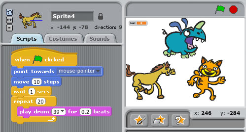
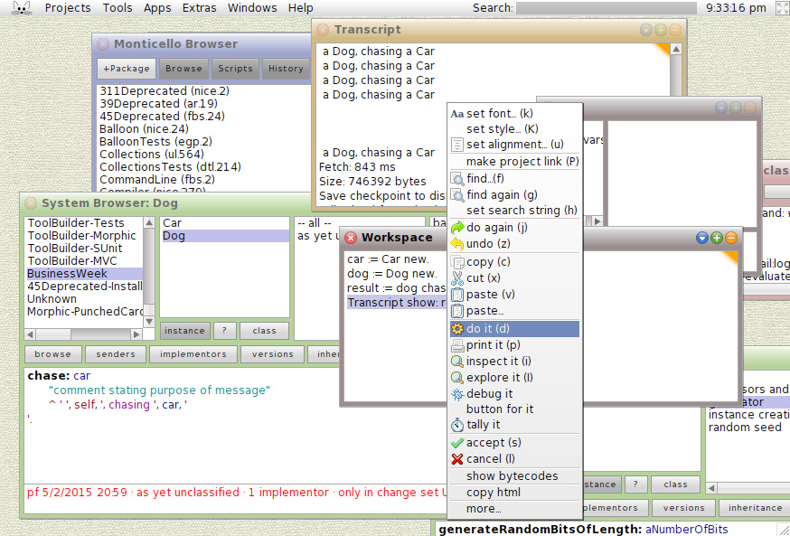
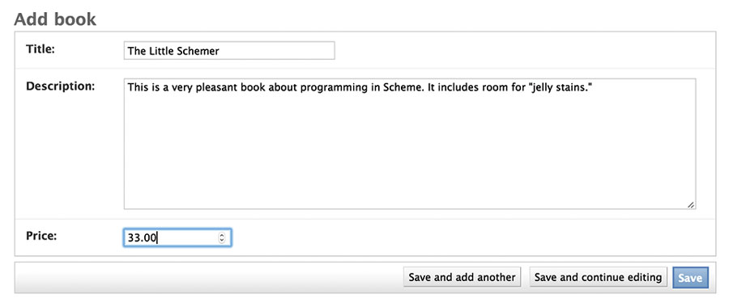
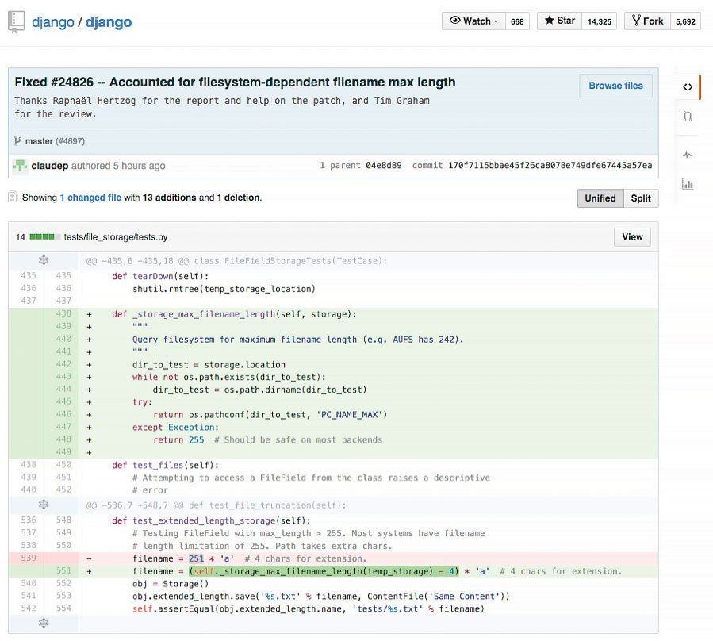

  * [Bloomberg the Company  ](http://www.bloomberg.com/company/?tophat=open)
  * [Bloomberg Anywhere Login  ](https://bba.bloomberg.net/)

# WHAT _IS_

## BUSINESSWEEK JUNE 11, 2015

## BY PAUL FORD

# CODE?|

 A message from Josh Tyrangiel

Software has been around since the 1940s. Which means that people have been
faking their way through meetings about software, and the code that builds it,
for generations. Now that software lives in our pockets, runs our cars and
homes, and dominates our waking lives, ignorance is no longer acceptable. The
world belongs to people who code. Those who don’t understand will be left
behind.

This issue comprises a single story devoted to ­demystifying code and the
culture of the people who make it. There’s some technical language along with
a few pretty basic mathematical concepts. There are also lots of solid jokes
and lasting insights. It may take a few hours to read, but that’s a small
price to pay for adding decades to your career.

_--Josh Tyrangiel_

1

## The Man in the Taupe Blazer

You are an educated, successful person capable of abstract thought. A VP doing
an SVP's job. Your office, appointed with decent furniture and a healthy
amount of natural light filtered through vertical blinds, is commensurate with
nearly two decades of service to the craft of management.

Copper plaques on the wall attest to your various leadership abilities inside
and outside the organization: One, the Partner in Innovation Banquet Award
2011, is from the sales team for your support of its 18-month effort to reduce
cycle friction--net sales increased 6.5 percent; another, the Civic Guidelight
2008, is for overseeing a volunteer team that repainted a troubled public
school top to bottom.

You have a reputation throughout the organization as a careful person,
bordering on penny-pinching. The way you'd put it is, you are loath to pay for
things that can't be explained. You expect your staff to speak in plain
language. This policy has served you well in many facets of operations, but it
hasn't worked at all when it comes to overseeing software development.

For your entire working memory, _some Internet thing_ has come along every two
years and suddenly hundreds of thousands of dollars (inevitably millions) must
be poured into amorphous projects with variable deadlines. Content management
projects, customer relationship management integration projects, mobile apps,
paperless office things, global enterprise resource planning initiatives--no
matter how tightly you clutch the purse strings, software finds a way to pry
open your fingers.

Here we go again. On the other side of your (well-organized) desk sits _this
guy_ in his mid-30s with a computer in his lap. He's wearing a taupe blazer.
He's come to discuss spending large sums to create intangible abstractions on
a "website re-architecture project." He needs money, support for his team, new
hires, external resources. It's preordained that you'll give these things to
him, because the CEO signed off on the initiative--and yet should it all go
pear-shaped, you will be responsible. Coders are insanely expensive, and
projects that start with uncomfortably large budgets have an ugly tendency to
grow from there. You need to understand where the hours will go.

Photographer: Corey Olsen for Bloomberg Businessweek

He says: "We're basically at the limits with WordPress."

Who wears a taupe blazer?

The CTO was fired six months ago. That CTO has three kids in college and a
mustache. It was a bad exit. The man in the taupe blazer (TMitTB) works for
the new CTO. She comes from Adobe and has short hair and no mustache.

Here is what you've been told: All of the computer code that keeps the website
running must be replaced. At one time, it was very valuable and was keeping
the company running, but the new CTO thinks it's garbage. She tells you the
old code is spaghetti and your systems are straining as a result. That the
third-party services you use, and pay for monthly, are old and busted. Your
competitor has an animated shopping cart that drives across the top of the
screen at checkout. That cart remembers everything customers have ever
purchased and generates invoices on demand. Your cart has no memory at all.

Salespeople stomp around your office, sighing like theater students, telling
you how embarrassed they are by the site. Nothing works right on mobile.
Orders are cutting off halfway. People are logged out with no warning.
Something must be done.

Which is why TMitTB is here.

Who's he, anyway? Webmaster? IT? No, he's a "Scrum Master."

"My people are split on platform," he continues. "Some want to use Drupal 7
and make it work with Magento--which is still PHP." He frowns. "The other
option is just doing the back end in Node.js with Backbone in front."

You've furrowed your brow; he eyes you sympathetically and explains: "With
that option it's all JavaScript, front and back."

Those are all terms you've heard. You've read the first parts of the Wikipedia
pages and a book on software project estimation. It made some sense at the
time.

You ask the universal framing question: "Did you cost these options?"

He gives you a number and a date. You know in your soul that the number is
half of what it should be and that the project will go a year over schedule.
He promises long-term efficiencies: The $85,000 in Oracle licenses will no
longer be needed; engineering is moving to a free, open-sourced database. "We
probably should have done that back when we did the Magento migration," he
says. Meaning, of course, that his predecessor probably should have done that.

You consult a spreadsheet and remind him that the Oracle contract was renewed
a few months ago. So, no, actually, at least for now, you'll keep eating that
cost. Sigh.

This man makes a third less than you, and his education ended with a B.S. from
a large, perfectly fine state university. But he has 500+ connections on
LinkedIn. That plus sign after the "500" bothers you. How many more than 500
people does he know? Five? Five thousand?

In some mysterious way, he outranks you. Not within the company, not in
restaurant reservations, not around lawyers. Still: He strokes his short
beard; his hands are tanned; he hikes; his socks are embroidered with little
ninja.

"Don't forget," he says, "we've got to budget for apps."

This is real. A Scrum Master in ninja socks has come into your office and
said, "We've got to budget for apps." Should it all go pear-shaped, his career
will be just fine.

You keep your work in perspective by thinking about barrels of cash. You once
heard that a U.S. dry barrel can hold about $100,000 worth of singles. Next
year, you'll burn a little under a barrel of cash on Oracle. One barrel isn't
that bad. But it's never one barrel. Is this a 5-barrel project or a
10-barreler? More? Too soon to tell. But you can definitely smell money
burning.

At this stage in the meeting, you like to look supplicants in the eye and say,
_OK, you've given me a date and a budget_. But when will it be done? Really,
truly, top-line-revenue-reporting finished? Come to confession; unburden your
soul.

This time you stop yourself. You don't want your inquiry to be met by a
patronizing sigh of impatience or another explanation about ship dates, Agile
cycles, and continuous delivery. Better for now to hide your ignorance. _When
will it be done?_ You are learning to accept that the answer for software
projects is _never_.

### 1.1 Why Are We Here?

We are here because the editor of this magazine asked me, "Can you tell me
what code is?"

"No," I said. "First of all, I'm not good at the math. I'm a programmer, yes,
but I'm an East Coast programmer, not one of these serious platform people
from the Bay Area."

I began to program nearly 20 years ago, learning via `oraperl`, a special
version of the Perl language modified to work with the Oracle database. A
month into the work, I damaged the accounts of 30,000 fantasy basketball
players. They sent some angry e-mails. After that, I decided to get better.

Which is to say I'm not a natural. I love computers, but they never made any
sense to me. And yet, after two decades of jamming information into my code-
resistant brain, I've amassed enough knowledge that the computer has revealed
itself. Its magic has been stripped away. I can talk to someone who used to
work at Amazon.com or Microsoft about his or her work without feeling a
burning shame. I'd happily talk to people from Google and Apple, too, but they
so rarely reenter the general population.

The World Wide Web is what I know best (I've coded for money in the
programming languages Java, JavaScript, Python, Perl, PHP, Clojure, and XSLT),
but the Web is only one small part of the larger world of software
development. There are 11 million professional software developers on earth,
according to the research firm IDC. (An additional 7 million are hobbyists.)
That's roughly the population of the greater Los Angeles metro area. Imagine
all of L.A. programming. East Hollywood would be for Mac programmers, West
L.A. for mobile, Beverly Hills for finance programmers, and all of Orange
County for Windows.

There are lots of other neighborhoods, too: There are people who write code
for embedded computers smaller than your thumb. There are people who write the
code that runs your TV. There are programmers for everything. They have
different cultures, different tribal folklores, that they use to organize
their working life. If you told me a systems administrator was taking a
juggling class, that would make sense, and I'd expect a product manager to
take a trapeze class. I've met information architects who list and rank their
friendships in spreadsheets. Security research specialists love to party.

What I'm saying is, I'm one of 18 million. So that's what I'm writing: my view
of software development, as an individual among millions. Code has been my
life, and it has been your life, too. It is time to understand how it all
works.

Every month it becomes easier to do things that have never been done before,
to create new kinds of chaos and find new kinds of order. Even though my math
skills will never catch up, I love the work. Every month, code changes the
world in some

interesting, 

wonderful, 

or disturbing way. 

2

## Let's Begin

A computer is a clock with benefits. They all work the same, doing second-
grade math, one step at a time: Tick, take a number and put it in box one.
Tick, take another number, put it in box two. Tick, _operate_ (an operation
might be addition or subtraction) on those two numbers and put the resulting
number in box one. Tick, check if the result is zero, and if it is, go to some
other box and follow a new set of instructions.

You, using a pen and paper, can do anything a computer can; you just can't do
those things billions of times per second. And those billions of tiny
operations add up. They can cause a phone to boop, elevate an elevator, or
redirect a missile. That raw speed makes it possible to pull off not one but
multiple sleights of hand, card tricks on top of card tricks. Take a bunch of
pulses of light reflected from an optical disc, apply some math to unsqueeze
them, and copy the resulting pile of expanded impulses into some memory cells
--then read from those cells to paint light on the screen. Millions of pulses,
60 times a second. That's how you make the rubes believe they're watching a
movie.

Apple has always made computers; Microsoft used to make only software (and
occasional accessory hardware, such as mice and keyboards), but now it's in
the hardware business, with Xbox game consoles, Surface tablets, and Lumia
phones. Facebook assembles its own computers for its massive data centers.

So many things are computers, or will be. That includes watches, cameras, air
conditioners, cash registers, toilets, toys, airplanes, and movie projectors.
Samsung makes computers that look like TVs, and Tesla makes computers with
wheels and engines. Some things that aren't yet computers--dental floss,
flashlights--will fall eventually.

When you "batch" process a thousand images in Photoshop or sum numbers in
Excel, you're programming, at least a little. When you use computers too much
--which is to say a typical amount--they start to change you. I've had
Photoshop dreams, Visio dreams, spreadsheet dreams, and Web browser dreams.
The dreamscape becomes fluid and can be sorted and restructured. I've had
programming dreams where I move text around the screen.

You can make computers do wonderful things, but you need to understand their
limits. They're not all-powerful, not conscious in the least. They're fast,
but some parts--the processor, the RAM--are faster than others--like the hard
drive or the network connection. Making them seem infinite takes a great deal
of work from a lot of programmers and a lot of marketers.

The turn-of-last-century British artist William Morris once said you can't
have art without resistance in the materials. The computer and its
multifarious peripherals are the materials. The code is the art.

### 2.1 How Do You Type an "A"?

Consider what happens when you strike a key on your keyboard. Say a lowercase
"a." The keyboard is waiting for you to press a key, or release one; it's
constantly scanning to see what keys are pressed down. Hitting the key sends a
scancode.

Just as the keyboard is waiting for a key to be pressed, the computer is
waiting for a signal from the keyboard. When one comes down the pike, the
computer interprets it and passes it farther into its own interior. "Here's
what the keyboard just received--do with this what you will."

It's simple now, right? The computer just goes to some table, figures out that
the signal corresponds to the letter "a," and puts it on screen. Of course not
--too easy. Computers are machines. They don't know what a screen or an "a"
are. To put the "a" on the screen, your computer has to pull the image of the
"a" out of its memory as part of a font, an "a" made up of lines and circles.
It has to take these lines and circles and render them in a little box of
pixels in the part of its memory that manages the screen. So far we have at
least three representations of one letter: the signal from the keyboard; the
version in memory; and the lines-and-circles version sketched on the screen.
We haven't even considered how to store it, or what happens to the letters to
the left and the right when you insert an "a" in the middle of a sentence. Or
what "lines and circles" mean when reduced to binary data. There are
surprisingly many ways to represent a simple "a." It's amazing any of it works
at all.

Coders are people who are willing to work backward to that key press. It takes
a certain temperament to page through standards documents, manuals, and
documentation and read things like "data fields are transmitted least
significant bit first" in the interest of understanding why, when you expected
"u," you keep getting "�."

### 2.2 From Hardware to Software

Hardware is a tricky business. For decades the work of integrating, building,
and shipping computers was a way to build fortunes. But margins tightened.
Look at Dell, now back in private hands, or Gateway, acquired by Acer. Dell
and Gateway, two world-beating companies, stayed out of software, typically
building PCs that came preinstalled with Microsoft Windows--plus various
subscription-based services to increase profits.

This led to much cursing from individuals who'd spent $1,000 or more on a
computer and now had to figure out how to stop the antivirus software from
nagging them to pay up.

Ballmer chants “Developers!”

Source: Youtube

Years ago, when Microsoft was king, Steve Ballmer, sweating through his blue
button-down, jumped up and down in front of a stadium full of people and
chanted, "Developers! Developers! Developers! Developers!"

He yelled until he was hoarse: "I love this company!" Of course he did. If you
can sell the software, if you can light up the screen, you're selling
infinitely reproducible nothings. The margins on nothing are great--until
other people start selling even cheaper nothings or giving them away. Which is
what happened, as free software-based systems such as Linux began to nibble,
then devour, the server market, and free-to-use Web-based applications such as
Google Apps began to serve as viable replacements for desktop software.

Expectations around software have changed over time. IBM unbundled software
from hardware in the 1960s and got to charge more; Microsoft rebundled
Internet Explorer with Windows in 1998 and got sued; Apple initially refused
anyone else the ability to write software for the iPhone when it came out in
2007, and then opened the App Store, which expanded into a vast commercial
territory--and soon the world had Angry Birds. Today, much hardware comes with
some software--a PC comes with an operating system, for example, and that OS
includes hundreds of subprograms, from mail apps to solitaire. Then you
download or buy more.

There have been countless attempts to make software easier to write, promising
that you could code in plain English, or manipulate a set of icons, or make a
list of rules--software development so simple that a bright senior executive
or an average child could do it. Decades of efforts have gone into helping
civilians write code as they might use a calculator or write an e-mail.
Nothing yet has done away with _developers, developers, developers,
developers._

Thus a craft, and a professional class that lives that craft, emerged.
Beginning in the 1950s, but catching fire in the 1980s, a proportionally small
number of people became adept at inventing ways to satisfy basic human desires
(know the time, schedule a flight, send a letter, kill a zombie) by
controlling the machine. Coders, starting with concepts such as "signals from
a keyboard" and "numbers in memory," created infinitely reproducible units of
digital execution that we call software, hoping to meet the needs of the
marketplace. Man, did they. The systems they built are used to manage the
global economic infrastructure. 1 If coders don't run the world, they run the
things that run the world.

Most programmers aren't working on building a widely recognized application
like Microsoft Word. Software is everywhere. It's gone from a craft of
fragile, built-from-scratch custom projects to an industry of standardized
parts, where coders absorb and improve upon the labors of their forebears
(even if those forebears are one cubicle over). Software is there when you
switch channels and your cable box shows you what else is on. You get money
from an ATM--software. An elevator takes you up five stories--the same.
Facebook releases software every day to something like a billion people, and
that software runs inside Web browsers and mobile applications. Facebook looks
like it's just pictures of your mom's crocuses or your son's school play--but
no, it's software.

Photographer: Boru O'Brien O'Connell for Bloomberg Businessweek; Set design:
Dave Bryant

### 2.3 How Does Code Become Software?

We know that a computer is a clock with benefits, and that software starts as
code, but how?

We know that someone, somehow, enters a program into the computer and the
program is made of code. In the old days, that meant putting holes in punch
cards. Then you'd put the cards into a box and give them to an operator who
would load them, and the computer would flip through the cards, identify where
the holes were, and update parts of its memory, and then it would--OK, that's
a little too far back. Let's talk about modern typing-into-a-keyboard code. It
might look like this:

    
    ispal: {x~|x}

That's in a language called, simply, K, famous for its brevity. 2 That code
will test if something is a palindrome. If you next typed in `ispal "able was
i ere i saw elba"`, K will confirm that yes, this is a palindrome.

So how else might your code look? Maybe like so, in Excel (with all the
formulas hidden away under the numbers they produce, and a check box that you
can check):

But Excel spreadsheets are tricky, because they can hide all kinds of things
under their numbers. This opacity causes risks. One study by a researcher at
the University of Hawaii found that 88 percent of spreadsheets contain errors.

Programming can also look like Scratch, a language for kids:

That's definitely programming right there--the computer is waiting for a
click, for some input, just as it waits for you to type an "a," and then it's
doing something repetitive, and it involves hilarious animals.

Or maybe:

    
    PRINT *, "WHY WON'T IT WORK
    END
    
    

That's in Fortran. The reason it's not working is that you forgot to put a
quotation mark at the end of the first line. Try a little harder, thanks.

All of these things are coding of one kind or another, but the last bit is
what most programmers would readily identify as code. A sequence of symbols
(using typical keyboard characters, saved to a file of some kind) that someone
typed in, or copied, or pasted from elsewhere. That doesn't mean the other
kinds of coding aren't valid or won't help you achieve your goals. Coding is a
broad human activity, like sport, or writing. When software developers think
of coding, most of them are thinking about lines of code in files. They're
handed a problem, think about the problem, write code that will solve the
problem, and then expect the computer to turn word into deed.

Code is inert. How do you make it ert? You run software that transforms it
into machine language. The word "language" is a little ambitious here, given
that you can make a computing device with wood and marbles. Your goal is to
turn your code into an explicit list of instructions that can be carried out
by interconnected logic gates, thus turning your code into something that can
be executed--software.

A compiler is software that takes the symbols you typed into a file and
transforms them into lower-level instructions. Imagine a programming language
called Business Operating Language United System, or Bolus. It's a terrible
language that will have to suffice for a few awkward paragraphs. It has one
real command, `PRINT`. We want it to print `HELLO NERDS` on our screen. To
that end, we write a line of code in a text file that says:

    
    PRINT {HELLO NERDS}

And we save that as `nerds.bol`. Now we run `gnubolus nerds.bol`, our
imaginary compiler program. How does it start? The only way it can: by doing
lexical analysis, going character by character, starting with the "p,"
grouping characters into tokens, saving them into our one-dimensional tree
boxes. Let's be the computer.

Character Meaning

P

_Hmmmm...?_

R

_Someone say something?_

I

_I'm waiting..._

N

[drums fingers]

T

_Any time now..._

Space

_Ah, "PRINT"_

{

_String coming!_

H

_These_

E

_letters__

L

_don't_

L

_matter_

O

_la_

Space

_la_

N

_just_

E

_saving_

R

_them_

D

_for_

S

_later_

}

_Stringtime is over!_

End of file

_Time to get to work._

The reason I'm showing it to you is so you can see how every character
matters. Computers usually "understand" things by going character by
character, bit by bit, transforming the code into other kinds of code as they
go. The Bolus compiler now organizes the tokens into a little tree. Kind of
like a sentence diagram. Except instead of nouns, verbs, and adjectives, the
computer is looking for functions and arguments. Our program above, inside the
computer, becomes this:

Trees are a really pleasant way of thinking of the world. Your memo at work
has sections that have paragraphs? Tree. Your e-mail program contains messages
that contain subject lines and addresses? Tree. Your favorite software program
that has a menu bar with individual items that have subitems? Tree. Every day
is Arbor Day in Codeville.

Of course, it's all a trick. If you cut open a computer, you'll find countless
little boxes in rows, places where you can put and retrieve bytes. Everything
ultimately has to get down to things in little boxes pointing to each other.
That's just how things work. So that tree is actually more like this:

Every character truly, truly matters. Every single stupid misplaced semicolon,
space where you meant tab, bracket instead of a parenthesis--mistakes can
leave the computer in a state of panic. The trees don't know where to put
their leaves. Their roots decay. The boxes don't stack neatly. For not only
are computers as dumb as a billion marbles, they're also positively
Stradivarian in their delicacy.

That process of going character by character can be wrapped up into a routine
--also called a function, a method, a subroutine, or component. (Little in
computing has a single, reliable name, which means everyone is always arguing
over semantics.) And that routine can be run as often as you need. Second, you
can print anything you wish, not just one phrase. Third, you can repeat the
process forever, and nothing will stop you until the machine breaks or,
barring that, heat death of the universe. Obviously no one besides Jack
Nicholson in _The Shining_ really needs to keep typing the same phrase over
and over, and even then it turned out to be a bad idea.

Instead of worrying about where the words are stored in memory and having to
go character by character, programming languages let you think of things like
strings, arrays, and trees. That's what programming gives you. You may look
over a programmer's shoulder and think the code looks complex and boring, but
it's covering up repetitive boredom that's unimaginably vast. 3

This thing we just did with individual characters, compiling a program down
into a fake assembly language so that the nonexistent computer can print each
character one at a time? The same principle applies to every pixel on your
screen, every frequency encoded in your MP3 files, and every imaginary cube in
Minecraft. Computing treats human language as an arbitrary set of symbols in
sequences. It treats music, imagery, and film that way, too.

It's a good and healthy exercise to ponder what your computer is doing right
now. Maybe you're reading this on a laptop: What are the steps and layers
between what you're doing and the Lilliputian mechanisms within? When you
double-click an icon to open a program such as a word processor, the computer
must know where that program is on the disk. It has some sort of accounting
process to do that. And then it loads that program into its memory--which
means that it loads an enormous to-do list into its memory and starts to step
through it. What does that list look like?

Maybe you're reading this in print. No shame in that. In fact, thank you. The
paper is the artifact of digital processes. Remember how we put that "a" on
screen? See if you can get from some sleepy writer typing that letter on a
keyboard in Brooklyn, N.Y., to the paper under your thumb. What framed that
fearful symmetry?

Thinking this way will teach you two things about computers: One, there's no
magic, no matter how much it looks like there is. There's just work to make
things look like magic. And two, it's crazy in there.

Photographer: Asger Carlsen for Bloomberg Businessweek; Set Design: Dave
Bryant

### 2.4 What Is an Algorithm?

"Algorithm" is a word writers invoke to sound smart about technology.
Journalists tend to talk about "Facebook's algorithm" or a "Google algorithm,"
which is usually inaccurate. They mean "software."

Algorithms don't require computers any more than geometry does. An algorithm
solves a problem, and a great algorithm gets a name. Dijkstra's algorithm,
after the famed computer scientist Edsger Dijkstra, finds the shortest path in
a graph. By the way, "graph" here doesn't mean  but
rather 

Think of a map; streets connect to streets at intersections. It's a graph!
There are graphs all around you. Plumbing, electricity, code compilation,
social networks, the Internet, all can be represented as graphs! (Now to
monetize …)

Many algorithms have their own pages on Wikipedia. You can spend days poking
around them in wonder. [Euclid's
algorithm](https://en.wikipedia.org/wiki/Euclidean_algorithm), for example, is
the go-to specimen that shows up whenever anyone wants to wax on about
algorithms, so why buck the trend? It's a simple way of determining the
greatest common divisor for two numbers. Take two numbers, like 16 and 12.
Divide the first by the second. If there's a remainder (in this case there is,
4), divide the first, 16, by that remainder, 4, which gives you 4 and no
remainder, so we're done--and 4 is the greatest common divisor. (Now translate
that into machine code, and we can get out of here.)

There's a site called Rosetta Code that shows you different algorithms in
different languages. The [Euclid's algorithm
page](http://rosettacode.org/wiki/Greatest_common_divisor) is great. Some of
the examples are suspiciously long and laborious, and some are tiny nonsense
poetry, like this one, in the language Forth:4

    
    : gcd ( a b -- n )
      begin dup while tuck mod repeat drop ;

Read it out loud, preferably to friends. Forth is based on the concept of a
stack, which is a special data structure. You make "words" that do things on
the stack, building up a little language of your own. PostScript, 5 the
language of laser printers, came after Forth but is much like it. Look at how
similar the code is, give or take some squiggles:

    
    /gcd {
    {
      {0 gt} {dup rup mod} {pop exit} ifte
    } loop
    }.

And that's Euclid's algorithm in PostScript. I admit, this might be fun only
for me. Here it is in Python (all credit to Rosetta Code):

    
    def gcd(u, v):
        return gcd(v, u % v) if v else abs(u)

A programming language is a system for encoding, naming, and organizing
algorithms for reuse and application. It's an algorithm management system.
This is why, despite the hype, it's silly to say Facebook has an algorithm. An
algorithm can be translated into a function, and that function can be called
(run) when software is executed. There are algorithms that relate to image
processing and for storing data efficiently and for rapidly running through
the elements of a list. Most algorithms come for free, already built into a
programming language, or are available, organized into libraries, for download
from the Internet in a moment. You can do a ton of programming without
actually thinking about algorithms--you can save something into a database or
print a Web page by cutting and pasting code. But if you want the computer to,
say, identify whether it's reading Spanish or Italian, you'll need to write a
language-matching function. So in that sense, algorithms can be pure,
mathematical entities as well as practical expressions of ideas on which you
can place your grubby hands.

Dijkstra distributed a remarkable and challenging set of 18 memos to the
global computer science community, starting in the 1960s and continuing up
until his death in 2002, known as "EWDs," many of them
[handwritten](http://www.cs.utexas.edu/~EWD/).

One thing that took me forever to understand is that computers aren't actually
"good at math." They can be programmed to execute certain operations to
certain degrees of precision, so much so that it looks like "doing math" to
humans. 6 Dijkstra said: "Computer science is no more about computers than
astronomy is about telescopes." 7 A huge part of computer science is about
understanding the efficiency of algorithms--how long they will take to run.
Computers are fast, but they can get bogged down--for example, when trying to
find the shortest path between two points on a large map. Companies such as
Google, Facebook, and Twitter are built on top of fundamental computer science
8 and pay great attention to efficiency, because their users do things
(searches, status updates, tweets) an extraordinary number of times. Thus it's
absolutely worth their time to find excellent computer scientists, many with
doctorates, who know where all the efficiencies are buried.

It takes a good mathematician to be a computer scientist, but a middling one
to be an effective programmer. Until you start dealing with millions of people
on a network or you need to blur or sharpen a million photos quickly, you can
just use the work of other people. When it gets real, break out the comp sci.
When you're doing anything a hundred trillion times, nanosecond delays add up.
Systems slow down, users get cranky, money burns by the barrel. 9

The hardest work in programming is getting around things that aren't
computable, in finding ways to break impossible tasks into small, possible
components, and then creating the impression that the computer is doing
something it actually isn't, like having a human conversation. This used to be
known as "artificial intelligence research," but now it's more likely to go
under the name "machine learning" or "data mining." When you speak to Siri or
Cortana and they respond, it's not because these services understand you; they
convert your words into text, break that text into symbols, then match those
symbols against the symbols in their database of terms, and produce an answer.
Tons of algorithms, bundled up and applied, mean that computers can fake
listening.

A programming language has at least two jobs, then. It needs to wrap up lots
of algorithms so they can be reused. Then you don't need to go looking for a
square-root algorithm (or a genius programmer) every time you need a square
root. And it has to make it easy for programmers to wrap up new algorithms and
routines into functions for reuse. The DRY principle, for Don't Repeat
Yourself, is one of the colloquial tenets of programming. That is, you should
name things once, do things once, create a function once, and let the computer
repeat itself. This doesn't always work. Programmers repeat themselves
constantly. I've written certain kinds of code a hundred times. This is why
DRY is a principle.

Enough talk. Let's code!

### 2.5 The Sprint

After a few months the budget is freed up, and the Web re-architecture project
is under way. They give it a name: Project Excelsior. Fine. TMitTB (who, to be
fair, has other clothes and often dresses like he's in Weezer) checks in with
you every week.

He brings documents. Every document has its own name. The functional
specification is a set of at least a thousand statements about users clicking
buttons. "Upon accessing the Web page the user if logged in will be identified
by name and welcomed and if not logged in will be encouraged to log in or
create an account. (See user registration workflow.)"

_God have mercy on our souls_. From there it lists various error messages.
It's a sort of blueprint in that it describes--in words, with occasional
diagrams--a program that doesn't exist.

Some parts of the functional specification refer to "user stories," tiny
hypothetical narratives about people using the site, e.g., "As a visitor to
the website, I want to search for products so I can quickly purchase what I
want." 10

Then there's something TMitTB calls wireframe mock-ups, which are pictures of
how the website will look, created in a program that makes everything seem as
if it were sketched by hand, all a little squiggly--even though it was
produced on a computer. This is so no one gets the wrong idea about these
ideas-in-progress and takes them too seriously. Patronizing, but point taken.

You rarely see TMitTB in person, because he's often at conferences where he
presents on panels. He then tweets about the panels and notes them on his
well-populated LinkedIn page. Often he takes a picture of the audience from
the stage, and what you see is an assembly of mostly men, many with beards,
the majority of whom seem to be peering into their laptop instead of up at the
stage. Nonetheless the tweet that accompanies that photo says something like,
"AMAZING audience! @ the panel on #microservice architecture at
#ArchiCon2015."

He often tells you just how important this panel-speaking is for purposes of
recruiting. Who's to say he is wrong? It costs as much to hire a senior
programmer as it does to hire a midlevel executive, so maybe going to
conferences is his job, and in the two months he's been here he's hired four
people. His two most recent hires have been in Boston and Hungary, neither of
which is a place where you have an office.

But what does it matter? Every day he does a 15-minute "standup" meeting via
something called Slack, which is essentially like Google Chat but with some
sort of plaid visual theme, and the programmers seem to agree that this is a
wonderful and fruitful way to work.

"I watch the commits," TMitTB says. Meaning that every day he reviews the code
that his team writes to make sure that it's well-organized. "No one is pushing
to production without the tests passing. We're good."

Your meetings, by comparison, go for hours, with people arranged around a
table--sitting down. You wonder how he gets his programmers to stand up, but
then some of them already use standing desks. Perhaps that's the ticket.

Honestly, you would like to go to conferences sometimes and be on panels. You
could drink bottled water and hold forth just fine.

### 2.6 What's With All These Conferences, Anyway?

Conferences! The website Lanyrd lists hundreds of technology conferences for
June 2015. There's an event for software testers in Chicago, a Twitter
conference in São Paulo, and one on enterprise content management in
Amsterdam. In New York alone there's the Big Apple Scrum Day, the Razorfish
Tech Summit, an entrepreneurship boot camp for veterans, a conference
dedicated to digital mapping, many conferences for digital marketers, one
dedicated to Node.js, one for Ruby, and one for Scala (these are programming
languages), a couple of breakfasts, a conference for cascading style sheets,
one for text analytics, and something called the Employee Engagement Awards.

Tech conferences look like you'd expect. Tons of people at a Sheraton, keynote
in Ballroom D. Or enormous streams of people wandering through South by
Southwest in Austin. People come together in the dozens or thousands and
attend panels, ostensibly to learn; they attend presentations and brush up
their skills, but there's a secondary conference function, one of
acculturation. You go to a technology conference to affirm your tribal
identity, to transfer out of the throng of dilettantes and into the zone of
the professional. You pick up swag and talk to vendors, if that's your thing.

![]
(images/sec1_conference08.jpg)

**First row:** TechCrunch Disrupt NYC, May 2011; Google I/O developers conference, San Francisco, May 2013; Global Mobile Internet Conference, Beijing, April 2015  
**Second row:**Nvidia GPU, San Jose, September 2010; South by Southwest (SXSW) Interactive Festival, Austin, March 2013; Apple Worldwide Developers Conference (WWDC), San Francisco, June 2008  
**Third row:** TechCrunch Disrupt NYC, May 2012; Re:publica conference, Berlin, May 2015; TechCrunch Disrupt NYC, May 2015   
**Fourth row:** SXSW Interactive Festival, Austin, March 2014; WWDC, San Francisco, June 2015; Bloomberg Technology Conference!, San Francisco, June 15-16 

Technology conferences are where primate dynamics can be fully displayed,
where relationships of power and hierarchy can be established. There are
keynote speakers--often the people who created the technology at hand or
crafted a given language. There are the regular speakers, often paid not at
all or in airfare, who present some idea or technique or approach. Then there
are the panels, where a group of people are lined up in a row and forced into
some semblance of interaction while the audience checks its e-mail.

I'm a little down on panels. They tend to drift. I'm not sure why they exist.

Here's the other thing about technology conferences: There has been much
sexual harassment and much sexist content in conferences. Which is stupid,
because computers are dumb rocks lacking genitalia, but there you have it.

Women in software, having had enough, started to write it up, post to blogs.
Other women did the same. The problem is pervasive: There are a lot of
conferences, and there have been many reports of harassing behavior. The
language Ruby, the preferred language for startup bros, developed the worst
reputation. At a Ruby conference in 2009, someone gave a talk subtitled
"Perform Like a Pr0n Star," with sexy slides. That was dispiriting. There have
been criminal incidents, too.

Conferences began to develop codes of conduct, rules and algorithms for people
(men, really) to follow.

If you are subject to or witness unacceptable behavior, or have any other
concerns, please notify a community organizer as soon as possible …

--_[Burlington Ruby Conference](http://www.burlingtonrubyconference.com/conduct)_

php[architect] is dedicated to providing a harassment-free event experience
for everyone and will not tolerate harassment or offensive behavior in any
form.

--_[php[architect]](http://www.phparch.com/policies/code-of-conduct/)_

The Atlanta Java Users Group (AJUG) is dedicated to providing an outstanding
conference experience for all attendees, speakers, sponsors, volunteers, and
organizers involved in DevNexus (GeekyNerds) regardless of gender, sexual
orientation, disability, physical appearance, body size, race, religion,
financial status, hair color (or hair amount), platform preference, or text
editor of choice.

--_[devnexus](https://www.devnexus.com/s/code-of-conduct)_

When people started talking about conference behavior, they also began to talk
about the larger problems of programming culture. This was always an issue,
but the conference issues gave people a point of common reference. Why were
there so many men in this field? Why do they behave so strangely? Why is it so
hard for them to be in groups with female programmers and behave in a typical,
adult way?

"I go to work and I stick out like a sore thumb. I have been mistaken for an
administrative assistant more than once. I have been asked if I was physical
security (despite security wearing very distinctive uniforms)," wrote a black
woman on Medium.com who has worked, among other places, at Google.

#### Famous women in coding history

  
Ada Lovelace: The first programmer. She devised algorithms for Charles
Babbage's "analytical engine," which he never built.

 Grace Murray Hopper: World War II
hero and inventor of the compiler.

"Always the only woman in the meeting, often the first--the first female R&D
engineer, first female project lead, first female software team lead--in the
companies I worked for," wrote another woman in _[Fast
Company](http://www.fastcompany.com/3008216/tracking/minding-gap-how-your-
company-can-woo-female-coders)_ magazine.

Fewer than a fifth of undergraduate degrees in computer science awarded in
2012 went to women, according to the National Center for Women & Information
Technology. Less than 30 percent of the people in computing are women. And the
number of women in computing has fallen since the 1980s, even as the market
for their skills has expanded. The pipeline is a huge problem. And yet it's
not unsolvable. I've met managers who have built perfectly functional large
teams that are more than half female coders. Places such as the handicrafts
e-commerce site Etsy have made a particular effort to develop educational
programs and mentorship programs. Organizations such as the not-for-profit
Girl Develop It teach women, and just women, how to create software.

It's all happening very late in the boom, though. In 2014 some companies began
to release diversity reports for their programming teams. It wasn't a popular
practice, but it was revealing. Intel is 23 percent female; Yahoo! is 37
percent. Apple, Facebook, Google, Twitter, and Microsoft are all around 30
percent. These numbers are for the whole companies, not only programmers.
That's a lot of women who didn't get stock options. The numbers of people who
aren't white or Asian are worse yet. Apple just gave $50 million to fund
diversity initiatives, equivalent to 0.007 percent of its market cap. Intel
has a $300 million diversity project.

The average programmer is moderately diligent, capable of basic mathematics,
has a working knowledge of one or more programming languages, and can
communicate what he or she is doing to management and his or her peers. Given
that a significant number of women work as journalists and editors, perform
surgery, run companies, manage small businesses, and use spreadsheets, that a
few even serve on the Supreme Court, and that we are no longer surprised to
find women working as accountants, professors, statisticians, or project
managers, it's hard to imagine that they can't write JavaScript. Programming,
despite the hype and the self-serving fantasies of programmers the world over,
isn't the most intellectually demanding task imaginable.

Which leads one to the inescapable conclusion: The problem with women in
technology isn't the women.

3

## Why Are Programmers So Intense About Languages?

Many conferences are organized around specific programming languages or
specific communities (PyCon for Python programmers; the Strata conference for
big data; Oscon for open-source coders); these are ritual events for the
people in those communities. Attendees gather, talk, and post the videos on
YouTube. Language matters.

Programmers track the success of computer languages the way other people track
sports rankings, commenting on Web forums such as Reddit (where many languages
get their own "subreddit," and
[reddit.com/r/programming](http://www.reddit.com/r/programming) currently has
620,202 readers), or [Hacker News](https://news.ycombinator.com/), run by the
venture capital firm Y Combinator (a company named after a special kind of
function that operates on other functions), or [Lambda the Ultimate](http
://lambda-the-ultimate.org/) (named after a series of papers written mostly in
the 1970s about the influential programming language Scheme--the more inside-
baseball the name, the nerdier the subject matter).

There are hundreds of programming blogs. Many large corporations let their
engineers blog (a generous gift, given how many recruiters are hovering).
Discussions about programming go on everywhere, in public, at all times, about
hundreds of languages. There is a keen sense of what's coming up and what's
fading out.

It's not simply fashion; one's career as a programmer depends on demonstrating
capacity in one or more languages. So there are rankings, frequently updated,
rarely shocking. As of April 15, the world's most-used computer languages,
according to the Tiobe index (which uses a variety of indicators to generate a
single ranking for the world of programming), are Java, C, C++, Objective-C,
and C#, followed by JavaScript, PHP, and Python. The rankings are necessarily
inexact; another list, by a consulting firm called RedMonk, gives JavaScript
the top spot, followed by Java. There are many possible conclusions here, but
the obvious one is that, all things being equal, a very good Java programmer
who performs well in interviews will have more career options than a similar
candidate using a more obscure language.

If you code, by the time a language breaks through to the top 10 or 20, you've
heard of it, read blog posts about it, heard people lament how terrible or
wonderful or misguided it is, possibly watched a few video tutorials, or
played with it a little. Taking new languages out for a spin is a good thing
for a programmer to do. Often all you have to do is download some files and
write a couple lines of code, then decide if you want to go further. Most
languages are free to download and use.

Why do people construct and then give away free languages? Well, the creation
of a good computer language is the work of an apex programmer. To have
produced a successful language is acknowledged as a monumental effort, akin to
publishing a multivolume history of a war, or fighting in one. The reward is
glory.

Changing a language is like fighting that war all over again, and some
languages have at times been trapped in a liminal state between their old,
busted selves, and their new, promised version. Perl 5, released in the mid-
1990s, was a language uniquely suited to the World Wide Web, and it grew as
the Web grew; Perl 6 was supposed to be better in every way, and a redesign
began with grand pronouncements in 2000. But after 15 years of people working
continually and often for free on a project they consider in the public
interest, there's still no official Perl 6. (Latest ETA: Christmas 2015.)

The Python language community, keenly aware of the Perl community's problems,
decided to make necessary but difficult changes to the language as part of the
transition from Version 2 to Version 3. They would modernize, clean up rough
edges--but avoid grand reinventions. Development of Python 3.0 started in
2006; the first working version came out in 2008; and in 2015, the transition
is ongoing.

Making a new language is hard. Making a popular language is much harder still
and requires the smile of fortune. And changing the way a popular language
works appears to be one of the most difficult things humans can do, requiring
years of coordination to make the standards align. Languages are large,
complex, dynamic expressions of human culture.

P

y

thon

Visual

B

asic

Uni

t

ed

C+

+

11

C

WordPress

M

e

xico

(PHP)

St

a

t

es

And

r

oid

G

r

eece

Indonesia

P

aki

s

tan

F

r

ance

Spain

South

A

fri

c

a

Nor

w

a

y

P

ortugal

R

ussia

Sw

eden

P

oland

Canada

C

z

ech

Germa

n

y

R

epublic

A

u

s

tria

I

r

eland

T

ur

k

e

y

China

N

e

w

Z

ealand

B

elgium

B

r

azil

Finland

A

r

ge

n

tina

I

r

an

Uk

r

aine

Node

.

js

AngularJS

iOS

C#

R

u

b

y

### 3.1 The Beauty of the Standard Library

The true measure of a language isn't how it uses semicolons; it's the
_standard library_ of each language. A language is software for making
software. The standard library is a set of premade software that you can reuse
and reapply.

Take Python, which is "batteries included," meaning that it comes with tons of
preexisting code, organized into "modules," that you can reuse. Its standard
library has functions that let you copy Web pages or replace words in a
document.

What does that mean, to process text? Well, you might have a string of text
(The Quick Brown Fox) and save it in a variable called `my_string`. So now you
can call standard methods on that string. You can say `my_string.lower()`, and
it will make all the words lowercase, producing "the quick brown fox."

Truly understanding a language's standard library is one of the ways one
becomes proficient in that language. Typically you just visit Web pages or
read a book.

But the standard library is only the beginning. For many languages--and Python
is exemplary--there's an enormous library of prewritten modules available for
nearly instantaneous download, using "package manager" software. A module (or
library, or package) is code that is intended to extend a language's
capabilities.

Let's say you work for an advertising agency and need to process through
100,000 pictures and scale and sharpen them.

You type one command: `sudo pip install Pillow`, and the Pillow module is
downloaded, compiled automatically, and placed into the correct directory for
later reuse. You have to know, of course, that most modern languages have
modules for image processing; you also need to know that Pillow is the most
commonly used image-processing toolkit. Knowing how to find that out is part
of the job of coding. You might learn it by Googling. You might ask a friend.
You might get that information out of a book, or a website like The
Hitchhiker's Guide to Python.

A coder needs to be able to quickly examine and identify which giant, complex
library is the one that's the most recently and actively updated and the best
match for his or her current needs. A coder needs to be a good listener.

But what a payoff! Now that Pillow is installed, you have, at your typing
fingertips, dozens of routines and functions related to image processing that
you can use in your code: change colors, rotate by a number of degrees, scale,
convert GIF images to JPEGs, and so forth. Or if you need to do very complex
numerical analysis and statistics work, you can download NumPy, and suddenly
an enormous range of mathematical algorithms are available to you, hundreds of
years of science and research boiled down. Audio processing, interacting with
peculiar hardware, speaking to databases--there are packages for all of these
things. But you need to know how to find them, what they are called. Code
isn't just obscure commands in a file. It requires you to have a map in your
head, to know where the good libraries, the best documentation, and the most
helpful message boards are located. If you don't know where those things are,
you will spend all of your time searching, instead of building cool new
things.

### 3.2 What Do Different Languages Do?

Photographer: Steven Brahms for Bloomberg Businessweek; Prop Stylist: Zachary
Kinsella

If all computer languages do the same thing (make the computer do what you
want), then why does it matter which one you choose? For the same reason that
you wouldn't take a bicycle to pick up a fridge or get a physical from an
oncological neurosurgeon. Some tools are better for certain jobs.

It's possible for a C programmer and a Java programmer to read each other's
code, but it's harder to make C code and Java code work together. C and Java
represent the world in different ways, structure data in different ways, and
address the components of the computer in different ways. There are true
benefits to everyone on a team using the same language. They're all thinking
the same way about how to instruct the computer to process data.

It's not necessary for every team across a big organization to use the same
language. In fact, it's often counterproductive. Large organizations have lots
of needs and use many languages and services to meet them. For example, Etsy
is built atop PHP--but its product-search service uses Java libraries, because
the solutions for search available in Java are great.

Some programming languages, such as C, will do their best to do exactly as you
ask, even if that means crashing your computer. Others, like OCaml and
Haskell, are very constrained and ask a programmer to hew to a narrow form,
trying to steer you away from anything stupid. 11

Some languages have cute logos, like the Go gopher.

There's Scratch, a teaching language for kids. It doesn't use text much at all
but allows li'l coders to move icons around on screen and assemble programs
like Legos. Its logo is a smiling cat on two legs.

And then there's Lisp, which didn't come with a logo when it was first
proposed in the 1950s but now has a community-created five-eyed alien holding
a flag with its proboscis. Lisp is a classic language. There are some
languages that just have authority, elegance--canonical computer languages.

And one of these is C. Most of the popular languages look a lot like it. C's
de facto logo is, well, the letter C. C is called C because it came after
another language. That language was called B.

### 3.3 The Importance of C

C is as big a deal as you can get in computing. Created by Dennis Ritchie
starting in the late 1960s at Bell Labs, it's the principal development
language of the UNIX operating system. Unix (lowercased now, to refer to the
idea of Unix instead of the branded version) is a simple operating system--
basically it's a kernel 12 that manages memory and runs software, a large
collection of very small utility programs, and a "shell" that helps you knit
programs into "shell scripts." If you couldn't do what you needed with shell
scripts, you might write a new utility in C and add it to the utility library.
This was a nice and practical way of working, and it coincided with the rise
of various kinds of networks that today we refer to collectively as the
Internet. So Unix spread from Bell Labs to academia, to large industrial
systems, and eventually leached into the water supply of computing until it
was everywhere. And everywhere that Unix went, C was sure to go.

Photographer: Jeremy Liebman for Bloomberg Businessweek

C is a simple language, simple like a shotgun that can blow off your foot. It
allows you to manage every last part of a computer--the memory, files, a hard
drive--which is great if you're meticulous and dangerous if you're sloppy.
Software made in C is known for being fast. When you compile C, it doesn't
simply become a bunch of machine language in one go; there are many steps to
making it really, ridiculously fast. These are called optimizations, and they
are to programming what loopholes are to taxes. Think of C as sort of a plain-
spoken grandfather who grew up trapping beavers and served in several wars but
can still do 50 pullups.

C's legendary, lucid manual and specification, _The C Programming Language_,
written by Ritchie and Brian Kernighan (known by its nickname, K&R), is a
quick and simple read--physically light in comparison with modern, heavy-stock
guides to programming on bookstore shelves. This recommended text was
published in 1978, when personal computing barely existed, back when a
computer was a large piece of industrial equipment used to control a
refrigeration system or calculate actuarial tables. It was in K&R that "Hello,
world!" became the canonical example program for any language. By convention,
almost every introduction to any programming language since then starts with a
variation on "Hello, world!"

Here is the ur-text of computational self-introduction:

    
    #include <stdio.h>
    
    int main()
    {
        printf("Hello, world!\n");
    }

Which will, when compiled and run, print "Hello, world!" to the screen. Let's
write a program where you give it a number x and it prints out all the squares
of the numbers from 1 to x--just the sort of practical, useful program that
always appears in programming tutorials to address the needs of people who
urgently require a list of squares.

    
    #include<stdio.h>
    
    void squares(int v) 
    {
      for (int i=1;i<v+1;i++) {
        printf("%d ", i*i);
      }
      printf("\n");
    }
    
    int main() 
    {
      squares(10);
    }
    

To compile this program on a Macintosh, I saved it as `squares.c` and opened
up Terminal.app and typed:

    
    gcc squares.c
    $ ./a.out

And it produced:

    
    1 4 9 16 25 36 49 64 81 100

That runs the GNU C Compiler and produces a default file called `a.out`, which
I ran on the command line, 13 to get my squared numbers, and bully for me. If
I wanted to change the code, I would run the commands, and the program would
update accordingly.

This isn't great code by any stretch. 14 You just need to squint a little to
see that there are small, repeatable units that fit together in certain ways.
There's a function called squares. That's the important part. You feed it a
number, an integer. Then it counts from 1 to that integer and with each count
it prints the square of that number. Then it prints a new line. Done.

The Linux kernel is written in C. The software that connects your printer to
your computer could be in C. The Web servers that serve up your Web pages are
often written in C. It's also a good language for writing other languages--
Python, PHP, and Perl are written in C, as are many others. C is a language
you use for building systems; it has the same role in computing that Latin did
among Renaissance academics. You won't often meet a serious practitioner of
the digital arts who doesn't have at least a passing familiarity. The more
serious scholars are pretty fluent.

But remember that list of popular languages? C++? Objective-C? C#? Java? What
many people code daily is not actually C, but one of the many Vulgates.
Advocates of these languages make various arguments in their favor; they are
better for large groups, for "programming in the large." These languages, they
say, organize code into libraries that are shareable, reusable, and less
likely to cause pain and suffering. These are object-oriented adaptations of
C.

### 3.4 The Corporate Object Revolution

If you're going to understand how code works in a corporate environment, you
need to understand what object-oriented programming is.

There are many definitions. I'll wade in and provide my own and face the
consequences. Object-oriented programming is, at its essence, a filing system
for code. As anyone who's ever shared a networked folder--or organized a
physical filing cabinet--knows, without a good shared filing system your
office will implode. C, people said in the 1980s and '90s, is a great
language! An excellent language! But it doesn't really let you organize
things. You end up with all these functions. It's a mess. I mean, we have this
data structure for our customers (name, address, and so forth), and we have
all these functions for manipulating that data (`update_address`, `send_bill`,
`delete_account`), but the thing is, those functions aren't related to the
data except by the naming convention. C doesn't have a consistent way to name
things. Which means it's hard to find them later. Object-oriented programming
gave programmers a great way to name things--a means of building up a library.
I could call (run) `update address` on a picture of a dog or an Internet
address. That approach is sloppy and dangerous and leads to bugs (our
forebears reasoned, and not without precedent), and it makes it hard to
program with big teams and keep track of everything.

Photographer: Thomas Albdorf for Bloomberg Businessweek; Prop Stylist: Amélie
Chapalain

So what if, whaaaat if, we made a little box called Customer (call it a
"class," as in the taxonomical sense, like a Customer is a subclass of the
species human, which is a subclass of mammal, etc.), and we put the data and
methods relating to customers into that box. (And by box, it's literally just
"`public class Customer {}`" and anything inside the `{}` relates to that
particular class.)

I mean, you wouldn't even need to look inside the box. You'd just download a
large set of classes, all nested inside one another, study the available,
public methods and the expected data, and start programming. Hey, you'd say,
let's put some data into our object, take some data out. Every time we have a
new customer we make a new instance of our class. Code can be a black box,
with tentacles and wires sticking out, and you don't need to--don't want to--
look inside the box. You can just put a couple of boxes next to each other,
touch their tentacles together, and watch their eldritch mating.

This works out very well, in theory.

The archetypal object-oriented programming language is Smalltalk, created by a
coterie of geniuses at Xerox PARC during that institution's most glorious of
glory days. After years of gestation, Smalltalk was born in 1972, the same
year as C, and gelled around 1980. It was inspired by many of the big ideas in
computer science, but also by Platonism, by cell biology, and by a predecessor
language called Simula, the first object-oriented language, which per its name
was designed to … simulate things. While C was created within the New Jersey
research facilities (Bell Labs) of an industrial monolith (AT&T) to solve
problems at hand, Smalltalk was built at the far-off California outpost of a
different industrial monolith, Xerox, to solve the problems of the distant
future. Thus Smalltalk represents the world differently than C.

Smalltalk has a funny name and a friendly attitude, but its specification ran
to 700 pages. It was a big system. C gave you an abstraction over the entire
computer, helping you manage memory and processes inside the machine.
Smalltalk gave you an abstraction over all of reality, so you could start
dividing the world into classes and methods and the like. Where C tried to
make it easier to do computer things, Smalltalk tried to make it easier to do
human things.

This isn't better or worse. It's just different. Here is some Smalltalk code:

    
    Transcript show: 'Hello, world!'.

It prints that short sentence in the Transcript Window on the user's screen.
The Transcript is an object--and here it's receiving a message `(show:)` with
an argument--i.e., input--"Hello," etc. You type that in, select it with your
mouse (even in the early 1980s), and tell the computer to execute it. It
compiles just that bit of code and adds it to the rest of the running system.
It looks like this:

Tons of windows all talking to each other. Each window is, well, an object.
And instead of programming it and compiling the program, then running it, you
just dive right into this living, breathing, window-full environment, and
start making new objects that send messages to other objects. If you save
where you are, and come back five years later, well, everything will look
exactly the same.

The thing is, all those boxes can be manipulated. They're all objects. It's
almost too powerful: The boundaries that are clear in most languages--between
data and code, between files and executables, between the operating system and
applications, between closed and open software--all of those borders are
fuzzed by design. Smalltalk is a vision of the computer as its own, native
medium. The whole system can be modified, by anyone. The dominant version is
called Squeak (logo: cute mouse), and a modernized version is called Pharo
(logo: lighthouse). Both are free and easy to download.

As a middling programmer I find the Smalltalk environment fascinating, but it
never pulls me all the way through the looking glass. One day, I've promised
myself, I'll read (or skim with intent) the huge Smalltalk specification from
the 1980s--a seminal text and a grand attempt to organize reality along
computer principles. The problem is that Smalltalk requires one to adopt not
just a method of working but also a philosophy of the world, where everything
is organized in a hierarchy of classes. I love to play with it, but I
typically stumble back to more familiar approaches. Being an advocate for
Smalltalk is a little like being very into Slovenian cinema or free jazz. Some
of its advocates are particularly brilliant people. I'm not one of them.

Smalltalk's history is often described as slightly tragic, because many of its
best ideas never permeated the culture of code. But it's still around, still
has users, and anyone can use Squeak or Pharo. Also--

  1. Java is an object-oriented language, influenced by C++, that runs on a virtual machine (just like Smalltalk).
  2. Objective-C, per its name, jammed C and Smalltalk together with no apologies.
  3. C# (pronounced "C sharp") is based on C and influenced by Java, but it was created by Microsoft for use in its .NET framework.
  4. C++ is an object-oriented version of C, although its roots are more in Simula.

The number of digital things conceived in 1972 that are still under regular
discussion is quite small. (It was the year of _The Godfather _and Al Green's
_Let's Stay Together_.) The world corrupts the pure vision of great ideas. I
pronounce Smalltalk a raging, wild, global success.

### 3.5 Look How Big and Weird Things Get With Just Python

Python is a very interesting language and quite popular, too. It's object-
oriented but not rigid. 15 And it's widely understood to be easier than C for
programmers to use, because it provides more abstractions for programmers to
reuse. It hides much of the weirdness of the computer and many details of how
computation is performed. Python is usually slower than C; this is the price
you pay for all those sweet levels of abstraction. In the vast majority of
cases this difference in speed truly doesn't matter, regardless of how much
people protest. It's only of consequence when you've built up a system in
Python and a part of it runs millions or billions of times, slowing down the
computer--and thus requiring more resources to get its work done.

What then? Does this mean you need to throw away all your Python and start
over in some other language? Probably not. Python has a deserved reputation as
a "glue language," meaning you can take code from other, lower-level languages
such as C, C++, and Fortran 77 (yes, as in the year 1977), code that is close
to the machine and known to be sound, and write "wrapper functions." That is,
you can embed the older, faster code in the newer, slower, but easier-to-use
system.

A big part of this process is in wrapping up the old code in nice, well-
organized Python functions. In many ways the idiom of a language is not just
how it looks but also how it feels. Some languages emphasize brevity. Some
support long, complex functions, while others encourage you to break up
functionality into small pieces. Style and usage matter; sometimes programmers
recommend Strunk & White's _The Elements of Style_--that's right, the one
about the English language. Its focus on efficient usage resonates with
programmers. The idiom of a language is part of its communal identity.

Python is not the glue for everything, though. It's hard to connect to Java
but fits C hand to glove. There's a version of Python designed to run inside
of Java and use Java code. That's called Jython. If you want a version that
works with Microsoft's .NET, you can go with IronPython.

But there's another way to interpret all this activity around Python: People
love it and want it to work everywhere and do everything. They've spent tens
of thousands of hours making that possible and then given the fruit of their
labor away. That's a powerful indicator. A huge amount of effort has gone into
making Python practical as well as pleasurable to use. There are lots of
conferences, frequent code updates, and vibrant mailing lists. You pick a
language not just on its technical merits, or its speediness, or the job
opportunities it may present, but also on its culture.

Python people, generally, are pretty cool.

4

## Why Are Coders Angry?

There's a website dedicated to language benchmarks, to measuring how fast
certain languages run compared with others, and it includes this preface to
stave off riots: "These are not the only compilers and interpreters. These are
not the only programs that could be written. These are not the only tasks that
could be solved. These are just 10 tiny examples." 16

It sometimes appears that everyone in coding has a beef. You can feel it
coming off the Web pages. There are a lot of defensive postscripts added in
response to outrage. "People have reacted strongly to this post," they'll
read. "I did not mean to imply that Java sucks."

Languages have agendas. People glom onto them. Blunt talk is seen as a good
quality in a developer, a sign of an "engineering mindset"--spit out every
opinion as quickly as possible, the sooner to reach a technical consensus.
Expect to be told you're wrong; expect to tell other people they're wrong.
(Masculine anger, bluntly expressed, is part of the industry.)

Coding is a culture of blurters. This can yield fast decisions, but it
penalizes people who need to quietly compose their thoughts, rewarding fast-
twitch thinkers who harrumph efficiently. Programmer job interviews, which
often include abstract and meaningless questions that must be answered
immediately on a whiteboard, typify this culture. Regular meetings can become
sniping matches about things that don't matter. The shorthand term for that is
"bikeshedding." (Who cares what color the bike shed is painted? Well …)

Code culture is very, very broad, but the geographic and cultural core is the
Silicon Valley engine of progress. The Valley mythologizes young geniuses with
vast sums. To its credit, this culture works; to its shame, it doesn't work
for everyone.

At any moment some new thing could catch fire and disrupt the tribal ebb and
flow. Instagram was written in Python and sold for $2 billion, so Python had a
moment of glory. The next mind-blowing app could show up, written in some new
language--and start everyone taking that more seriously. Within 18 months your
skills could be, if not quite valueless, suspect.

I was in a meeting once where someone said, "How long will it take to fix
that?" One person, who'd been at the company for years, said, "Three months."
A new person, who'd just come from a world of rapidly provisioned cloud
microservices, said, "Three minutes." They were both correct. That's how
change enters into this world. Slowly at first, then on the front page of
Hacker News.

Programmers carve out a sliver of cognitive territory for themselves and go to
conferences, and yet they know their position is vulnerable. They get
defensive when they hear someone suggest that Python is better than Ruby,
because [insert 500-comment message thread here]. Is the next great wave
swelling somewhere, and will it wash away Java when it comes? Will Go conquer
Python? Do I need to learn JavaScript to remain profitable? Programmers are
often angry because they're often scared. We are, most of us, stumbling around
with only a few candles to guide the way. We can't always see the whole
system, so we need to puzzle it out, bit by bit, in the dark.

### 4.1 The Legend of the 10x Programmer

Programming has twin cults of genius and youth. One of the ways Google
acquired its reputation was by hiring fresh-faced whizzes. Ph.D.s from
Stanford, Cal Tech, MIT, and Carnegie Mellon were table stakes. The true
programmer began to code in utero and has an IQ of at least 10,000.

There's even the legend of the 10x programmer, an individual who is just that
much more productive than the proletariat. There is evidence that some
programmers are much more productive than their equally experienced peers; but
other studies have found this to be engineering folklore. Ten is an order of
magnitude in a discipline that uses orders of magnitude to estimate things.
Ten is an attractive and thus suspicious number.

That said, the industry undeniably attracts brilliant thinkers. I've met a
few. You can tell they're brilliant because their solutions make you laugh and
go, "Oh, I would never have thought of that." The sparks in their brains jump
some pretty wide gaps. They know more than the manuals. Some people put the
time in; some people can't help but be obsessed; and some people are just so
damn smart that it's a revelation to be around them.

Dream of 10x programmers if you will. But I wouldn't hold out hope that one
will come to work for you. You can't hire them for the same reasons you can't
coach the Chicago Bulls and you aren't often called upon to date supermodels
of your preferred gender. They're not interviewing at your crappy company for
your crappy job. They're not going to come and rescue your website; they're
not going to make you an app that puts mustaches on photos; they're not going
to listen to you when you offer them the chance to build the next Facebook,
because, if they exist, they are busy building the real Facebook. Sometimes
they're thinking about higher mathematics, or how to help a self-driving car
manage the ethical choice between running over a squirrel and driving off a
cliff. Or they're riding their bikes, or getting really into pottery. It's
hard to have a better life than a great programmer, as long as they're
unencumbered by physical or mental illness.

Programming is a task that rewards intense focus and can be done with a small
group or even in isolation. It's come to have an association with Asperger's
syndrome; many programmers will say they "are somewhere on the spectrum,"
though these self-diagnoses can be a little self-serving--being obsessive is
seen as a good thing by many coders. And some jobs programs have successfully
placed people on the autism spectrum in programming careers. But the idea that
people with Asperger's make good programmers is as suspect as the idea that
women aren't naturally inclined to coding; both assumptions, to use a term
beloved of the Internet, are problematic, and deeply reductive. Tread lightly:
All kinds of people can be programmers. And autistic people can have all kinds
of careers.

If 10x programmers exist, they require 10x managers at 10x companies. There's
no shame in not being 10x yourself.

For a truly gifted programmer, writing code is a side effect of thought. Their
skill isn't in syntax; it's how they perceive time and computation. They can
see the consequences of their actions more quickly than the next programmer;
they spend less time in the dark. Their code still has bugs, it still needs to
be optimized--they're not without flaws. But for every candle we own, they
have three or four flashlights and a map.

### 4.2 The Thing About Real Artists Is That They--

Photographer: Boru O'Brien O'Connell for Bloomberg Businessweek; Set design:
Dave Bryant

As a class, programmers are easily bored, love novelty, and are obsessed with
various forms of productivity enhancement. God help you if you're ever caught
in the middle of a conversation about nutrition; standing desks; the best
keyboards; the optimal screen position and distance; whether to use a plain
text editor or a large, complex development environment; chair placement; the
best music to code to; the best headphones; whether headphone amplifiers
actually enhance listening; whether open-plan offices are better than
individual or shared offices; the best bug-tracking software; the best
programming methodology; the right way to indent code and the proper placement
of semicolons; or, of course, which language is better. And whatever you do,
never, ever ask a developer about productivity software.

#### Productivity Enhancers

**Nutrition: Soylent**  
Heralded as "the end of food." Contains potato and rice starches, oat flour,
oils, vitamins, and minerals. It was invented in 2013 by Rob Rhinehart, a
programmer hoping to make mealtime more efficient. Price: $70 for a bag of
Soylent powder, or about $3 per meal.

**Caffeine delivery system: Club-Mate**  
A fizzy drink from a Bavarian brewery sold mostly in Europe. It's made from
yerba mate, which has caffeine and polyphenols. Programmers also loooove
coffee.

**Computer: 13-inch MacBook Pro**  
Widely rated as having best-in-class hardware, these machines are capable of
running Mac as well as Windows and Linux operating systems.

**Text editor: Highly subjective**  
Developers use scores of different text editors, programs that allow them to
more easily write and debug code. Favorites include Sublime Text, Text
Wrangler, and Brackets.

**Old-school desk: The Jerker**  
Nerds in countless online forums pine after this discontinued modular Ikea
workstation, which allows a user to customize desk and shelf height. It sells
for about $250 on EBay.

**Standing desk: GeekDesk Max**  
With four preset heights, a steel frame, and dual motors that lift or lower
the tabletop at 1.1 inches per second, this desk can support up to 335 pounds.
It comes in small ($949) and large ($985).

Meanwhile, the executives who run large programming teams have to actually
ship software. "Ship" is a cult word. If they don't ship on time, managers
could get a lower rating on their performance reviews and end up making only
inordinate, as opposed to obscene, amounts of money. Wine cellars are at risk,
not to mention alimony payments. As managers, their job--along with all the
trust falls and consensus-building and active listening--is to reduce ship
risk, which comes in many forms: bad bugs; features that were promised to
bosses or clients that distract from boring, utterly necessary features; or
test servers that crash at night.

One of the greatest ship risks is anything shiny. This is where languages are
particularly risky. An experienced and talented programmer can learn a
language in a week, but a middling one is going to take much longer.
Meanwhile, exciting, interesting programming languages always come with a list
of benisons, promises of speed or productivity or just happiness. No, really.
Happiness is a serious selling point for languages, and people have written
blog posts where they analyze how people discuss code. According to an
analysis by GitHub user Tobias Hermann, PHP coders are far more likely to use
the word "hate" in their Reddit comments than Clojure programmers; Clojure
programmers are far more likely to use the word "cool" than PHP programmers.

There are many blog posts on how to persuade your manager to switch to a new
language. Experienced managers, who bear scars and were often coders
themselves, become practiced at squinting and coughing and saying things like,
"No, the switching cost is just too high right now," or, "Maybe we could do a
two-week trial project when we build the analytics reporting engine." 17

Then the programmers shuffle back to their standing desks and complain until
the product is shipped. Or else they just quit, because Lord knows there are
jobs out there. For programmers, particularly the young ones, there are jobs
everywhere.

Managers and old coders have fewer options. It's often better to just keep
working and shipping, even if the code starts to look ugly, even if there are
nominally better solutions, even as the technical debt 18 accrues around you,
because in a few years everything will change. Maybe you'll get promoted and
the new manager will have the will and motive to tear up everything you did,
cursing, and start again (perhaps using a new language) with the goal of
making something much simpler. Or the entire industry will spasm and
everything you've done will need to be thrown away and rebuilt along new lines
anyway. (From desktop to Web, from Web to mobile, from mobile to … quantum?
Who knows. But there's always something.)

Somehow it keeps working out. The industry is always promising to eat itself,
to come up with a paradigm so perfect that we can all stop wasting our time
and enter a world of pure digital thought. It never happens.

### 4.3 We Still Need to Choose …

Nine weeks into the re-architecture, you have asked TMitTB to come by the
office and talk next steps.

You've noticed that his team has started to dress like him. One of the women
is in tall boots and has done something complex with her hair. She's wearing a
black leather jacket. Nothing ostentatious, just cooler. She was previously
all Patagonia. Is this how programmers dress? How did they get their own
executive style?

"PHP," he says, "well--it is what it is. The team had a good time at
PHP[world]. But I think the thing we might have learned …"

He doesn't pronounce the brackets, of course, but you approved the expense,
and that's how they write it, bracketed. It's good they had a good time,
because it cost you $25,000 to send them to that conference and put them in
hotels and feed them, and you have no idea whether that was money well spent
or not.

"… is that we really need to move off of PHP."

Oh. Well. There's your answer.

"We're all agreed that PHP isn't the language for our next five years."

"Which one would you say is?"

"Ay, there's the rub," he says, and you have to remind yourself to not show
him your real face right now. If he quotes _Hamlet_ again, though …

"Well," you ask, "which language do you want to use?"

He looks confused. "I mean, it doesn't matter," he says. "I don't write the
code."

Then who does? And you realize, right now, the answer is no one.

### 4.4 Why Are There So Many Languages?

One of the famous papers in computing, "The Next 700 Programming Languages,"
by P.J. Landin, talks about the 1,700 languages already cluttering up the
computing landscape. It was written for an academic journal and has a
wonderfully accurate, koan-like opening statement: "Most programming languages
are partly a way of expressing things in terms of other things and partly a
basic set of given things." It was published in 1966.

A few of those 1,700 languages are still with us. 19 Cobol, for example, a
legendary and much-hated, extremely verbose language that was intimately
linked to the "year 2000" problem. As computer scientist Dijkstra once
described it, "The use of Cobol cripples the mind; its teaching should,
therefore, be regarded as a criminal offence."

While no one sings its praises (except for banks--banks love Cobol), it still
runs on mainframes. Fortran, for Formula Translating System, by John Backus,
and LISP, for List Processor, by John McCarthy (eventually it was lowercased
to Lisp, just as UNIX became Unix), were both developed in the 1950s, in the
days of _Desk Set_-style computers fed by huge tapes or paper cards, and both
are still in use today. The power granted by Fortran was inherent in its name
--it looks almost comically computerish:

    
        PROGRAM SQUARES
        CALL SQUARE(10)
        END
        SUBROUTINE SQUARE(N)
        SUM = 1
        DO 10 I = 1, N
        WRITE (*,'(I10,$)') (I*I)
    10  CONTINUE
        PRINT *, ""
        END

"Much of my work has come from being lazy. I didn't like writing programs, and
so, when I was working on the IBM 701, writing programs for computing missile
trajectories, I started work on a programming system to make it easier to
write programs."

-- _John Backus, 1979, in _Think_, the IBM employee magazine_

That's the same program that we wrote in C, page 50, the one that ever-so-
usefully prints a list of squares. You can pick up the weird metallic smell of
large computer centers with raised floors just by looking at some Fortran. 20
It excels at the numerical computing needed by scientists and still beats C
for some tasks. Physicists and astronomers like (well, live with) Fortran.

Lisp, though, is another kind of beast. It emerged straight out of
mathematical research. There are many things that made Lisp peculiar. Some
people say it stands for "Lots of superfluous parentheses." 27

    
    (defun squares (count)    
      (dotimes (n count)
        (format t "~a " (* (+ n 1)
 (+ n 1)))))
    (squares 10)
    

Back in the 1980s, while the Fortran programmers were off optimizing nuclear
weapon yields, Lisp programmers were trying to get a robot to pick up a teddy
bear or write a sonnet. But one day, the people who ran the funding parts of
the world came in, yelled, "Shut it all down," and pulled a big red switch
(which was probably programmed in Fortran). The Lisp programmers, who had yet
to simulate a human brain or automatically produce a great sonnet, were left
with only regret. 22 The Lisp machine companies began to shut down and sell
off their assets. Students were more likely to learn C or Java. Lisp became a
cautionary tale, its unique, unified vision of the computer a fond memory of a
better era. And yet …

There's still quite a bit of Lisp in the world, such as in the air-travel data
system built by ITA, which was acquired by Google. When you Google "flight
from nyc to berlin," ITA is in there in the background, running Lisp. There
was a time when Lisp looked to be deader than ancient Greek: a beautiful
philosophical system, but not practical.

Lisp blurs the line between code and data in the way it allows functions to
refer to themselves. It works, but it's a little much to ask a regular
programmer to see the world as infinitely programmable. We need clarity.

Which means we really need to talk about data.

5

## The Time You Attended the E-mail Address Validation Meeting

In the interest of understanding more about how all this works, and with an
open invitation from TMitTB, you attend a meeting of the programmers.

Two of them are late, and bravely you ask the one already in attendance to
explain what's going on. He quickly gathers the limits of your information
through a series of questions, beginning with, "Do you know what a Web page
is?"

Here's what he shows you: To gather an e-mail address and a name, you can make
a Web page using HTML. 23

Here's the HTML--make changes below!

    
    <html>
      <body>
        <h1>Make an account</h1>
        <form method="post" action="/">
          Name: <input type="text" name="name">
           
          Email: <input type="text" name="email">
          <input type="submit">
        </form>
      </body>
    </html>

And that looks like this:

On today's agenda: How to make sure that registration is a positive experience
for users but also a secure experience for the company. The questions to be
discussed, the programmer tells you, are along the lines of, "Where will you
put this data? Will you put it in a text file? What will you do with it? How
will you act upon it?"

Enter the remaining two programmers. Programmer A, who is senior, takes her
place at the whiteboard. …

**Programmer A:** "Let's just start with e-mail validation."

**Programmer B:** "Can you define valid?"

**Programmer C:** "A well-formed--"

--well-formed via a regular expression test?

--or well-formed according to RFC 5321 and RFC 5322?

Let's assume a library, OK?

Do we send everyone who submits a form a confirmation message?

We should, right?

Is it in the spec?

No.

Then we shouldn't do it.

Well, wait, maybe we should update the spec.

It's best practice.

Can I say what worries me?

Wait-capture that. We need to check on confirmations.

Got it.

What really, really worries me are "temporary" e-mail services, right? Like
Mailinator.com, which allows you to give out "disposable" e-mail addresses.

So don't let anyone enter a Mailinator address.

_[Typing.]_

Right, but Mailinator.com doesn't have just one address. It has, like, 300.

So get a list.

There's no list actually. You have to go and reload the Mailinator page and
make a list and cross your fingers.

Yeah, we looked at this. There's no list.

Can we not rathole on Mailinator before we talk overall security?

I mean, if we're counting on the library validation, is that good enough? No
one is going to enter a 500-page e-mail.

Russians will.

Very possibly.

But we can set upload limits, right?

Sort of, but we also allow people to upload large images for their profiles-up
to 2 megabytes.

So?

No, he's right. Those all come as a lump, so someone could enter a 500-page-
long e-mail, and we need to check it.

I'll take that if you want, because it's going to relate to the overall
database schema.

Can we catch it at the database?

That's why I'll take it.

Someone take a picture of the whiteboard?

Sure.

And we should talk about account expiration?

Is that in the spec?

No, but it's a dependency for the password-expiration admin tool.

Who owns that?

And on it goes, whiteboard after whiteboard, punctuated by the sound of a
mobile phone's fake camera shutter. "Do we need to keep track of how many
times they've been e-mailed?" "How do we remove e-mails once they're in the
system?" "What if someone enters the same e-mail twice?"

Programmer A, the leader, seems very professional. She's at the whiteboard,
scribbling, erasing, scribbling, erasing. Lists, arrows, boxes, lines. She
wrote RUSSIANS? on the board. But after an hour you realize: This is just
e-mail. One field. One little bit of data. You haven't even hit names yet.
What if the user has one name? What if Bono or Cher signs up for an account?
What if it's the Chinese Bono? Do we want to allow sign-ups in Chinese? What
browsers do we need to support? Do the call center people need to be able to
manage accounts?

It's hard not to think of barrels of cash burning.

Programmer B is entering things into a tracking system, creating issues,
assigning tasks to people. A flurry of e-mailed assignments is emerging from
this meeting. Programmer C is young and annoying and very programmery, but the
others seem to like him well enough.

How do we ensure that credit cards are valid, that physical addresses are
real? Will we perform financial transactions ourselves? Which external systems
will integrate with our systems? Who will get the sales reports? We didn't
talk about the mailing list software. We didn't talk about password length,
the number of letters and symbols necessary for passwords to be secure, or
whether our password strategy on this site will fit in with the overall
security profile of the company, which is the responsibility of a different
division.

So this is the work. It goes on for days.

It gets turned into specifications and user stories, then reviewed with
TMitTB, who right now is away at a conference (but tells you he's overjoyed
you attended this meeting).

Not a line of code is written throughout this process.

### 5.1 What Is the Relationship Between Code and Data?

Data comes from everywhere. Sometimes it comes from third parties--Spotify
imports big piles of music files from record labels. Sometimes data is user-
created, like e-mails and tweets and Facebook posts and Word documents.
Sometimes the machines themselves create data, as with a Fitbit exercise
tracker or a Nest thermostat. When you work as a coder, you talk about data
all the time. When you create websites, you need to get data out of a database
and put them into a Web page. If you're Twitter, tweets are data. If you're
the IRS, tax returns are data, broken into fields.

Data management is the problem that programming is supposed to solve. But of
course now that we have computers everywhere, we keep generating more data,
which requires more programming, and so forth. It's a hell of a problem with
no end in sight. This is why people in technology make so much money. Not only
do they sell infinitely reproducible nothings, but they sell so many of them
that they actually have to come up with new categories of infinitely
reproducible nothings just to handle what happened with the last batch. That's
how we ended up with "big data." I've been to big-data conferences and they
are packed.

### 5.2 Where Does Data Live?

It's rare that a large task is ever very far from a database. Amazon, Google,
Yahoo!, Netflix, Spotify--all have huge, powerful databases.

The most prevalent is the relational database, using a language called SQL,
for Structured Query Language. Relational databases represent the world using
tables, which have rows and columns. SQL looks like this:

    
    SELECT * FROM BOOKS WHERE ID = 294;

Implying that there's a table called BOOKS and a row in that table, where a
book resides with an ID of 294. IDs are important in databases. Imagine a
bookstore database. It has a customer table that lists customers. It has a
books table that lists books. And it has a clever in-between table of
purchases with a row for every time a customer bought a book. 24

Congratulations! You just built Amazon! Of course, while we were trying to
build a bookstore, we actually built the death of bookstores--that seems to
happen a lot in the business. You set out to do something cool and end up
destroying lots of things that came before.

Relational databases showed up in the 1970s and never left. There's Oracle, of
course. Microsoft has SQL Server; IBM has DB2. They all speak SQL and work in
a similar manner, with just enough differences to make it costly to switch.

Oracle makes you pay thousands of dollars to use its commercial enterprise
database, but more and more of the world runs on free software databases such
as PostgreSQL and MySQL. There's even a tiny little database called SQLite
that's so small, so well-behaved, and so permissively licensed that it's now
in basically every smartphone, available to apps to help them save and load
data. You probably have a powerful SQL-driven database in your pocket right
now.

### 5.3 The Language of White Collars

If you walk up to some programmers and say, "Big corporate programming,"
they'll think of Java. Go to any of the popular coding job sites, such as
dice.com, and search for openings in New York City--almost 2,000 results for
Java on a recent search; 1,195 for JavaScript; 930 for Python; 344 for Ruby.
Only two for Lisp.

Java is a programming language that was born at Sun Microsystems (R.I.P.), the
product of a team led by a well-regarded programmer named James Gosling. It's
object-oriented, but it also looks a lot like C and C++, so for people who
understood those languages, it was fairly easy to pick up. It was conceived in
1991, eventually floating onto the Internet on a massive cloud of marketing in
1995, proclaimed as the answer to every woe that had ever beset programmers.
Java ran on every computer! Java would run right inside your Web browser, in
"applets" (soon called "crapplets"), and would probably take over the Web in
time. Java! It ran very slowly compared with more traditional languages such
as C. What was it for? Java! They also had network-connected computer
terminals called JavaStations. Java! Kleiner Perkins Caufield & Byers even
announced a $100 million Java fund in 1996. But after all that excitement,
Java sort of … hung out for a while. The future didn't look like Sun said it
would.

Java running "inside" a Web browser, as a plug-in, never worked well. It was
slow and clunky, and when it loaded it felt like you were teetering on the
edge of disaster, a paranoia that was frequently validated when your browser
froze up and crashed. Java-enabled jewelry, meant to serve as a kind of
digital key/credit card/ID card, also had a low success rate. But Java was
free to download and designed to be useful for small and large teams alike.

Here are some facts about Java to help you understand how it slowly took over
the world by the sheer power of being pretty good.

Photographer: Joanna Mcclure for Bloomberg Businessweek; Prop Stylist: Amy
Henry

It was a big language. It came with a ton of code already there, the "class
library," which had all the classes and methods you'd need to talk to a
database, deal with complex documents, do mathematics, and talk to various
network services. There were a ton of classes in that library waiting to be
turned into objects and brought to life.

It automatically generated documentation. This was huge. Everyone says code
deserves excellent documentation and documentation truly matters, but this is
a principle mostly proven in the breach. Now you could run a tool called
`javadoc`, and it would make you Web pages that listed all the classes and
methods. It was lousy documentation, but better than nothing and pretty easy
to enhance if you took the time to clean up your code.

There were a lot of Java manuals, workshops and training seminars, and
certifications. Programmers can take classes and tests to be officially
certified in many technologies. Java programmers had an especially wide range
to choose from.

It ran on a "virtual" machine, which meant that Java "ran everywhere," which
meant that you could run it on Windows, Mac, or Unix machines and it would
behave the same. It was an exceptionally well-engineered compromise. Which
made it perfect for big companies. As the 2000s kept going, Java became more
popular for application servers. Creating a content management system for a
nongovernmental organization with 2,000 employees? Java's fine. Connecting
tens of thousands of people in a company to one another? Java. Need to help
one bank talk to another bank every day at 5:01 p.m.? Java. Charts and
diagrams, big stacks of paper, five-year projects? Java. Not exciting, hardly
wearable, but very predictable. A language for building great big things for
great big places with great big teams.

People complain, but it works. 25

### 5.4 Briefly on the Huge Subject of Microsoft

Of course if you are Microsoft, this is intolerable. You can't have some other
company creeping into your banks and enterprises with this dumb language. You
can't have people choosing to run stuff on a virtual machine when they should
be running it on Windows machines, as God and Bill Gates intended.

Microsoft Windows 95 Video Guide with Jennifer Aniston and Matthew Perry from
Friends

Source: Youtube

Don't ever count Microsoft out. Its great corporate skill has always been to
take the sheer weirdness of computer ideas and translate them for
corporations, in the language of Global Business Leadership. Whatever is
discussed in this issue, Microsoft offers at least one of it. Statically
typed, scripting, data-driven, functional--name your ambiguous adjective, and
Microsoft will sell something that delivers that to you, and you can write
Windows code in it and live a Windows life. And this is not disparagement;
Microsoft products can be as good as or better than anything else on the
market.

### 5.5 Liquid Infrastructure

"Enterprise" is a feared word among programmers, because enterprise
programming is a lot of work without much to show for it. Remember
healthcare.gov, the first version that was a total disaster? Perfect example
of enterprise coding. At the same time, programmers respect big systems--when
they work. We respect the ambition of huge heavy machines running big blobs of
code. We grew up reading about supercomputers. Big iron is cool, even if the
future seems to be huge cloud platforms hosting with tons of cheap computers.

But Java is also in wide use at Google. It's a language for places such as
General Electric and Accenture. These aren't startups, but if their product
schedules slip, so does their revenue, and they are beholden to the public
markets. Gigantic data-driven organizations are structured around code, around
getting software made. But that doesn't mean their teams are huge--Amazon, for
example, is famous for its two-pizza rule: "Never have a meeting where two
pizzas couldn't feed the entire group."

 

These companies have cultures that know how to make software. They have whole
departments dedicated to testing. The process is important because there are
so many moving pieces, many of them invisible.

Academic researchers often produce things that basically work but don't have
interfaces. They need to prove their theses, publish, and move on to the next
thing. People in the free software community often code to scratch an itch and
release that code into the digital commons so that other people can modify and
manipulate it. While more often than not this process goes nowhere, over time
some projects capture the imagination of others and become part of the
infrastructure of the world.

Java, interestingly, profits from all this. It's designed for big corporate
projects and has the infrastructure to support them. It's also a useful
language for midsize tasks. So the libraries that you need to do things--image
processing, logging on to files, full-text search--keep appearing at a steady
clip, improving on the standard libraries or supplanting them entirely.

Eventually, people realized that if they didn't like the Java language, they
could write other languages that compile to Java "bytecode" and run on the
Java virtual machine (JVM). So there are now many languages that run on top of
Java. Some are versions of well-known languages, such as Jython and JRuby.
Others are totally new, like Scala, which is one of the languages that Twitter
began to use when it outgrew Ruby. There's also Clojure, which is … a Lisp.
That is, Clojure takes a much-adored computer language that was born in the
1950s, updates it for the 2010s, and gives that language the ability to reuse
all the Java classes in the world.

Clojure was created by Rich Hickey, who decided that he wanted a new, modern
version of Lisp. 26 Lisp may be old for a language, but it's still revered as
a classic model for thought, like a Braun shaver or an Eames chair for the
mind. Hickey worked on Clojure for many years, eventually adapting it to run
on the JVM. This was a dramatic choice, because it meant that Clojure had
access to the entirety of the Java class library.

Now you walk into the office and sit at your computer and write a little Lisp-
ish code, very elegant and well-considered and trim and comfortable, but you
have access to thousands and thousands of incredibly well-thought-out and
totally functional free libraries that you can use to get your work done.

Anything Java can do, Clojure can do. And since it's built atop the JVM, it
can do it on any computer. There were already Lisp editing tools out there,
and it was pretty easy to modify them for Clojure. It was joined to Java like
a remora to a shark. Or more accurately, it's a remora attached to a remora,
because the JVM itself is a fake machine running inside real machines.

Clojure is beloved but not widely used. Perhaps it will become more popular.
It shows up in interesting places. It's used at Wal-Mart Stores to collect and
manage receipt data, for example. It was ported to the world of Microsoft and
runs right inside Excel. It's the craziest thing. Take a spreadsheet. Inside
the spreadsheet is some Clojure code just running away, addressing the
different cells and columns. Someone made a version that compiles (well,
transpiles) to JavaScript, so blam, Clojure's running in your Web browser.
Actually that version is called ClojureScript.

The point is that things are fluid in the world of programming, fluid in a way
that other industries don't seem to be. Languages are liquid infrastructure.
You download a few programs and, whoa, suddenly you have a working Clojure
environment. Which is actually the Java Runtime Environment. You grab an old
PC that's outlived its usefulness, put Linux on it, and suddenly you have a
powerful Web server. Now you can participate in whole new cultures. There are
meetups, gatherings, conferences, blogs, and people chatting on Twitter. And
you are welcomed. They are glad for the new blood.

Java was supposed to supplant C and run on smart jewelry. Now it runs
application servers, hosts Lisplike languages, and is the core language of the
Android operating system. 27 It runs on billions of things. It won. C and C++,
which it was designed to supplant, also won. A lot of things keep winning
because computers keep getting more plentiful. It's weird.

### 5.6 Off the Shelf

A few weeks later, when he's in the office and in for his meeting, you ask
TMitTB if there's a way to use more off-the-shelf components, a way to buy
your way out of this.

#### _Sending an e-mail_

**If you need your JavaScript application to automatically send someone an e-mail, you might do something like:**

  1. Google `npm e-mail;`
  2. Follow the first link; see that there's a very common module simply called "e-mail" that was downloaded 5,015 times a month;
  3. Type `npm install e-mail` from your command-line;
  4. Skim the Web page for the module looking for sample code;
  5. Copy and paste the code;
  6. Modify it a little;
  7. Run the code by typing `node myscript.js;`
  8. Stare in perplexity when nothing happens;
  9. Spend half a day or more configuring your mail server so it actually sends e-mail;
  10. Send yourself so much e-mail that your corporate network blocks you as spam;
  11. Give up on that for a day;
  12. Try to run the e-mail code the next day;
  13. Repeat the thousands of times with a familiar sense of dread;
  14. Once it works, check it into the code repository, send an e-mail to the team, and update the status of code in the issue tracker;
  15. Promise yourself that you will write documentation and tests tomorrow;
  16. Never write these things.

He makes a face. Sort of, he says, but when you're making a system that will
integrate with the systems around it and your company is a set of such
systems, nothing is truly off the shelf. There are tools and packages and
libraries, and if you have any wit at all you already use well-documented,
free code for things such as e-mail validation, but that obviates only so
much.

"Everything is edge cases," he says. "Testing and edge cases."

You come to the conclusion: The world is broken.

### 5.7 What About JavaScript?

Remember Netscape, the first huge commercial Web browser? In 1995, as Java was
blooming, Netscape was resolving a problem. It displayed Web pages that were
not very lively. You could have a nice cartoon of a monkey on the Web page,
but there was no way to make the monkey dance when you moved over it with your
mouse. Figuring out how to make that happen was the job of a language
developer named Brendan Eich. He sat down and in a few weeks created a
language called JavaScript.

JavaScript's relationship with Java is tenuous; the strongest bond between the
languages is the marketing linkage of their names. And the early history of
JavaScript was uninspiring. So the monkey could now dance. You could do things
to the cursor, make things blink when a mouse touched them.

But as browsers proliferated and the Web grew from a document-delivery
platform into a software-delivery platform, JavaScript became, arguably, the
most widely deployed language runtime 28 in the world. If you wrote some
JavaScript code, you could run it wherever the Web was--everywhere.

JavaScript puttered around for years in the wilderness, as Java did, too. But
without the resolute support of a corporate entity like Sun.

Then, about a decade ago people began to talk about Ajax29--the idea that you
could build real software into a Web page, not just a document, but a program
that could do real work.

Things could respond and change according to inputs. You could distribute your
software to hundreds of millions of people this way, and JavaScript would work
for them. It wasn't as controlled as Java, it was much slower than natively
compiled C, and it had a terrible lack of niceties. And yet: Gmail, Google
Maps, Flickr, Twitter, and Facebook. Every single pixel on a Web page can be
manipulated now; the type can be changed, the words can move around; buttons
can be pressed.

As with any celebrity, there’s a whole industry dedicated to spackling up its
deficiencies and making it look good. There are books about the “good parts”
of JavaScript; there are libraries that make it easier and more consistent to
program, too, such as jQuery, which can turn the many lines of code necessary
to make a paragraph disappear into a single `$("p.optional").hide();`.

Back in the era of the iPod and candy-colored Macintoshes, Apple took the code
of an open-source Web browser called Konqueror and modified it to create
Safari, its own Web browser to compete with Microsoft’s Internet Explorer.
Then in 2008 Google started to make its own modifications to the Web engine
underneath Safari, called Webkit, and made its own version called Chrome with
a ­spanking-fast JavaScript engine called V8. They made JavaScript fast. “Devs
still approach performance of JS code as if they are riding a horse cart,”
tweeted one developer, “but the horse had long been replaced with fusion
reactor.” Google does better when JavaScript is fast.

In 2008 a developer named Ryan Dahl modified the V8 engine, which was free
software, and made it run outside the browser. There had been freestanding
versions of JavaScript before (including some that ran inside Java, natch),
but none so fast. He called this further fork Node.js, and it just took off.
One day, JavaScript ran inside Web pages. Then it broke out of its browser
prison. Now it could operate anywhere. It could touch your hard drive, send
e-mail, erase all your files. It was a real programming language now. And the
client … had become the server.

Here's some JavaScript, squaring some numbers for you:

    
    function squares(count) {
        var x = [];
        for (var i=1;i<count+1;i++) {
        x.push(i*i);
        }
        console.log(x.join(" "));
    }
    squares(10);

In a great and sudden wave, thousands of developers began to use Node.js and
create modular libraries. If you knew how JavaScript worked on a Web page,
then you could make it work on a server. And a few interesting characteristics
of the language made it good for writing software that handles lots of
simultaneous users. JavaScript listened for lots of things at once in a Web
browser: A mouse moves; a key is typed; some information comes in from the
network. On a server it could listen to dozens or hundreds of people all at
once and give them the information they requested.

Soon the community developed a huge library of packages--bits of software that
do specific things, such as reading files, or chattering with databases, or
talking to Amazon's Web services tools. At this writing, npmjs.com has 150,000
packages, and more than a billion copies of various packages have been
downloaded in the past month.

NPM stands for Node Package Manager. It's software that helps you install
packages and … well, it's unwieldy, honestly, because many of those 150,000
packages are just not that great. It's a lot of searching and testing and
sighing. But when you have this much stuff to pick from, for free, you
shouldn't complain. 30 JavaScript is a hodgepodge designed in a hurry, and it
runs on, well, who knows, but let's say a billion-plus devices, so you might
as well get with the program. Your customers may not have iPhones, but they
probably have some way of running JavaScript.

So you might use JavaScript to make a more interesting Web page. You might use
it to make the client-side of a full-fledged application, like Google Docs,
that runs in the browser. You might use it to make a Web server that talks to
a Web browser. Or you might use it to make an API 31 that serves up data to a
"client," and sure, that client could be a laptop Web browser. But it's 2015,
and that client is quite probably an app on a smartphone.

### 5.8 What's the Absolute Minimum I Must Know About PHP?

You can get a site up and running in PHP in a few minutes, and that's the
problem. It used to be the terrible choice you made when you needed to get
something done on the Web, but increasingly JavaScript has replaced it as the
default terrible choice.

PHP stands for Personal Home Page/Forms Interpreter. The idea was that when
you loaded your Web pages, the PHP code would run before the page went out to
the Internet. And PHP could, say, check whether you were logged in. If you
were, it could show you your top secret account details; and if you weren't,
it could say, "Please log in."

I know a lot of people who program in PHP, and they are smart, good people.
PHP powers Etsy and Facebook. It powers Wikipedia, for God's sake. WordPress.
Out of all the Web's pages, an enormous percentage is created with PHP.

Photographer: Jeremy Liebman for Bloomberg Businessweek

Coding in PHP for a living is not a death sentence. Lots of people have gotten
rich off PHP. It just means a lot of cutting and pasting, and a lot of trips
to Google to figure out why things aren't working.

Poor, sad, misbegotten, incredibly effective, massively successful PHP.
Reading PHP code is like reading poetry, the poetry you wrote freshman year of
college.

I spent so many hundreds, maybe thousands, of hours programming in PHP, back
when I didn't know what I was doing and neither did PHP. Reloading Web pages
until my fingers were sore. (I can hear your sympathetic sobs.) Everything was
always broken, and people were always hacking into my sites.

PHP. I don't wish it any harm. I'm glad to see how well it's done for itself.
We had some good times together. I just don't ever want to go back there.

6

## How Are Apps Made?

One of the privileges of owning a Mac is that you can download a program by
Apple called Xcode. This is an IDE, an Integrated Development Environment. 32

It's an enormous download, more than 2 gigabytes, or roughly the size of an
hour of DVD-quality video. Xcode is the heart of Apple. It's not only how the
company writes software, it's the tool for everyone who wants to write
software for the Mac or iPhone. 33

Within Xcode are whole worlds to explore. For example, one component is the
iOS SDK (Software Development Kit). You use that to make iPhone and iPad apps.
That SDK is made up of dozens and dozens of APIs (Application Programming
Interfaces). There's an API for keeping track of a user's location, one for
animating pictures, one for playing sounds, and several for rendering text on
the screen and collecting information from users. And so forth.

Maybe you're starting to see some strands here. Remember the way the Smalltalk
environment worked, a screen with a bunch of windows? There are powerful
echoes in Xcode.

There are other ways of working--I tend to do most of my code in a text editor
with a black background, far less to see at first glance, though actually just
as complex--but this right here is some serious code life. You fill out some
fields, wire some things together (really, sometimes it's done by connecting
virtual wires into virtual holes), and start coding.

When someone from Apple stands onstage and announces some new thing that ends
with "Kit," such as ResearchKit or HealthKit--or WatchKit, the set of routines
specifically for the Apple Watch--Xcode is where those kits will land, fully
documented, to be used to make software.

Some functions are reserved for the manufacturer. You know how Apple is
touting that you can track someone's heartbeat using an Apple Watch? Apple
hasn't documented how to do it yet, not for the world. Maybe the company is
worried that you'll misuse it somehow. Perhaps heartbeat monitoring requires
careful battery management, and because the watch already has battery issues,
Apple wants to avoid making things worse by letting anyone in there. It's
likely that people are trying to figure out how to access that heartbeat API
right now, though. That's just the way people are.

Apple is really good at all of this. It publishes interface guidelines and
gives people tools for arranging app interfaces in predictable ways that end
users will find familiar. It sets the flow with which to go.34

Let's say you're making a podcasting application, and playing an audio file is
a key feature. Great. Create an object of class AVAudioPlayer, and add a
button to the screen, then connect that button to the code so that when
clicked, the button sends the message "play."

There's a lot going on at once, so you want to leave it to the operating
system to keep track of where windows are. It's up to an IDE to help you
connect your ideas into this massive, massive world with tens of thousands of
methods so you can play a song, rewind a song, keep track of when the song was
played (meaning you also need to be aware of the time zones), or keep track of
the title of the song (which means you need to be aware of the language of the
song's title--and know if it displays left-to-right or right-to-left).

You should also know the length of the song, which means you need a mechanism
for extracting durations from music files. Once you have that--say, it's in
milliseconds--you need to divide it by 1,000, then 60, to get minutes. But
what if the song is a podcast and 90 minutes long? Do you want to divide
further to get hours? So many variables. Gah!

I guess you have problems to solve after all. The IDE doesn't do everything
for you.

The greatest commercial insight of the technology industry is that if you
control a computing environment, you can move the market. You can change the
way people do things, the way they listen to music, watch videos, and respond
to advertising. People who work at technology companies are supposed to take
an idea and multiply it by a few million people, yielding a few billion
dollars.

A great way to do that is to wrap up your intentions in APIs and SDKs and
IDEs. That's why so much software to make software is free: It stimulates the
development of even more software.

Sometimes this is the result of corporate ambition: Java was very much a Sun
product, down to the class library; the same is true of C# for Microsoft. But
much of the code in the world is freely available, created by generous
volunteers over decades to serve their own needs. The give-and-take between
corporations and programming languages is complex. Some language developers
are hired to work on their open-sourced languages; Go and Python have been
funded, to varying degrees, by Google; and the creator of PHP works at Etsy.

#### The Many Button Bezels of Apple

In Mac OS X, there's a class called NSButton. It intercepts the clicks of a
mouse. A programmer makes a button and tells it what to do when someone clicks
on it. A programmer also writes the code that sets a bezel.

**Push Button:** Most commonly used button

**Gradient Button:** Usually below lists or grids

**Rounded Rect Button:** Used for filtering in Mac Finder and Mail

**Rounded Textured Button:** Designed for toolbars only

**Textured Button:** Usage is a mystery

**Recessed Button:** Used as a toggle button only

**Inline Button:** New style of push button or indicator

Apple and Microsoft, Amazon and Google: factory factories. Their APIs are the
products of many thousands of hours of labor from many programmers. Think of
the work involved. Someone needs to manage the SDK. Hundreds of programmers
need to write the code for it. People need to write the documentation and
organize the demos. Someone needs to fight for a feature to get funded and
finished. Someone needs to make sure the translation into German is completed
and that there aren't any embarrassing mistakes that go viral on Twitter.
Someone needs to actually write the software that goes into making the IDE
work.

The modern OS is a feast of wonders: fast video, music players, buckets of
buttons. Apple may be the best imaginary button maker in history. Just the
bezels are a work to behold. Today there are 15 bezel styles, from
NSThickSquareBezelStyle to NSSmallSquareBezelStyle. 35 Freedom. (Sort of.
They're still just bezels.) Things that used to require labor and care--
showing a map, rotating a giant 3D landscape--can now be done with a few lines
of code.

When everyone goes to Apple's annual Worldwide Developers Conference in San
Francisco and they stare rapturously as some man in an untucked, expensive
shirt talks about "core data," this is the context. Onstage, presenting its
Kits, Apple is rearranging abstractions, saying: Look at the new reality we've
defined, the way that difficult things are now easy and drab things can be
colorful. Your trust in our platform and your dedication of thousands of hours
of time have not been misplaced.

They've pitched variations on this annually for 30 years.

In Xcode you can compile everything with one command, and up pops your
software for testing. You can see the button you made. You need to click on
it. It yearns for clicks. It cries out in a shrill signaling voice like a nano
cat on a microfence. Everything inside a computer beseeches everything else.
It's a racket. You click your mouse, and the button cat is finally satisfied.
Now the computer can increase the volume, change the color, or bring out the
talking paper clip. Destiny fulfilled and, after many rounds of this, test
complete.

When your app is done, you may sell it in an app store. And if users are
excited to use your app, they'll be motivated to buy more apps. Loops upon
loops, feeding into one another, capital accruing to the coffers of the
patient software giants. An ecosystem. "Ecosystem" is another debased word,
especially given what we keep doing to the real, physical one around us. But
if a few hundred thousand people are raising their kids and making things for
100 million people, that's what they call it.

### 6.1 The Framework: Wilder, Younger Cousin of the Software Development Kit

Odds are, if you're doing any kind of programming, especially Web programming,
you've adopted a framework. Whereas an SDK is an expression of a corporate
philosophy, a framework is more like a product pitch. Want to save time? Tired
of writing the same old code? Curious about the next new thing? You use a
graphics framework to build graphical applications, a Web framework to build
Web applications, a network framework to build network servers. There are
hundreds of frameworks out there; just about every language has one.

Django Reinhardt, guitar virtuoso and namesake of the Django framework

A popular Web framework is Django, which is used for coding in Python.
Instagram was bootstrapped on it. When you sit down for the first time with
Django, you run the command `"startproject,"` and it makes a directory with
some files and configuration inside. This is your project directory. Now you
have access to libraries and services that add to and enhance the ­standard
library. 36

Suppose we're still making our bookstore, the Amazonesque one with the
relational database that we started a few pages back. With Django, we run the
`"startproject"` command. You might tell it to start an app called bookstore.
Then you'd "set up your models," meaning you'd start to define how your data
looks, using Python's idioms, which the framework will translate into
database-ese.

    
    from django.db import models
    
    class Book(models.Model):
        title = models.CharField(max_length=140)
        description = models.TextField()
        price = models.DecimalField(max_digits=6,decimal_places=2)

So now we can make a book catalog. (Obviously we need to add authors and the
like.) The incredibly neat thing is that with a few more lines of
configuration you have a completely functional, working Web-based article
editor; to wit:

That's called the "admin" view, and it's always been a main feature of Django.
Your work as a programmer has just started, but very soon after the moment of
conception, your users--journalists, if you're building a publishing platform,
or alpha testers, or maybe just you, in a testing frame of mind--can start to
play with your baby, entering books, trying things out.

Take a moment on that. You learn a programming language like Python. You need
to make a website that allows a few dozen people to enter data at once. You
write a few lines of Python code and set up accounts for people using the
admin, and they can start to enter that data. If you do it a few times, you
can get very good at this sort of work. You can get a team started on a
project in a few hours.

Remember those issues about entering e-mail addresses? If you use Django, you
can use "`EmailField`," and many of them are taken care of. Ditto many of the
security concerns that arise when building websites, the typical abuses people
perpetrate. You have entered into a pool with many thousands of other
programmers who share the framework, use it, and suggest improvements; who
write tutorials; who write plug-ins that can be used to accomplish tasks
related to passwords, blogging, managing spam, providing calendars,
accelerating the site, creating discussion forums, and integrating with other
services. You can think in terms of architecture.

Magnificent! Wonderful! So what's the downside? Well, frameworks lock you into
a way of thinking. You can look at a website and, with a trained eye, go, "Oh,
that's a Ruby on Rails site."

Frameworks have an obvious influence on the kind of work developers can do.
Some people feel that frameworks make things too easy and that they become a
crutch. It's pretty easy to code yourself into a hole, to find yourself trying
to force the framework to do something it doesn't want to. Django, for
example, isn't the right tool for building a giant chat application, nor would
you want to try competing with Google Docs using a Django backend. You pay a
price in speed and control for all that convenience. The problem is really in
knowing how much speed, control, and convenience you need.

Programmers talk about "premature optimization"--overthinking your code before
you know what the real problems will be--and describe people who overthink
programming as "architecture astronauts." There's another tendency, NIH ("not
invented here"), that comes up a lot.

Frameworks can feel a little insulting, because they anticipate your problems
and are used by thousands of people. They imply that yours are common,
everyday problems, rather than special, amazing mysteries that require a true
genius to solve.

The opinions of a framework are strong, but not as strong as an SDK. Those are
tightly bundled, often commercial, and arrive with PR trumpets blasting,
especially when they're from Apple or Microsoft. Frameworks tend to be derived
from frustration and on first release are bound with tape and thrust onto the
Web with a blog post. From there they survive--or not. There are Web
application frameworks for every major language; [one Wikipedia listing](https
://en.wikipedia.org/wiki/Comparison_of_web_application_frameworks) 37 shows
almost 40 different frameworks for Java alone and almost 30 for PHP.

Most of the good frameworks are free, released to solve problems and bring
glory and influence to their creators, rather than great riches and control.
They spread organically. People see a video tutorial showing them how to make
a blog in a few minutes. Then they copy that work and say, "That was easy,"
and show their friends. Websites go live, and programmers talk about how
quickly they developed said websites.

If you're building a Web app, you'd be a fool not to use a Web framework at
first. There are tiny ones for control freaks, focused on URL routing, and
massive ones like Django and Rails, which pursue the goals first outlined by
large systems such as Smalltalk in days of yore: to enable the development of
large, collaborative systems where data can be manipulated and shared. Take
the work that's been done for you. DRY (don't repeat yourself).

### 6.2 What Is Debugging?

In programming, there are as many ways to destroy something as to create
something. One stray character is all that's required. Say you forget a
semicolon or use an accented "e" somewhere, but the code is not prepared for
such a peculiarity--KABOOM! Or you add two things together, but one is the
numeral 4 and the other is "4" as a string, as you might use to say "4 and 20
blackbirds baked in a pie." To the computer, that "4 and 20" has no numeric
significance.

This sort of thing really happens, and part of the job is remembering that 4 +
20 is 24 and 4 + "20" is "420."

Programming is debugging. It's the expectation that things won't work. This is
not something people bring up, just like they don't bring up their medical
history on the first date. Most languages have constructs built in for
catching failures, trapping them like wild animals, examining them, and, well,
exterminating them. In time, as the relationship between you and a programming
language blossoms, you come to realize that what truly characterizes a
language is not what it does, but how it tells you what broke. Most of your
programming life will be spent trying to figure out what broke, and if the
computer helps you, maybe you can watch your kids play soccer.

When I started programming I felt that each time the program crashed, I'd
failed. I found myself cringing, desperate, unable to move forward. There's
even a novel by Ellen Ullman, _The Bug_, about the anxieties and social
complexities that arise when a serious bug is hard to find.

Eventually, though, I learned to submit. I let myself drift into the computer,
to remember the math I know, the things I understand about types and
categories and lists and syntax. Sometimes bugs cause error messages to pop
up; sometimes they cause the program to give up the ghost and quit suddenly;
sometimes they get caught in terrible loops and fill up the memory and choke
all the resources of the computer until it has to be restarted. That's called
a stack overflow. Sometimes a request goes too hard, for example, calling
itself so many times that the stack, which is a finite resource, fills up and
can't take it anymore. Hence the name of the website Stack Overflow, where
programmers go to answer questions and help each other solve bugs. It's the
62nd-most-visited website in the world, trailing Craigslist by a few spots.

Randomly selected item from Stack Overflow, to give you a taste of
programming:

Angular 1.3 + ui-router + generator-hg-poly embedding nested(?) views not
working

--_TheOncomingCode, StackOverflow.com_

TheOncomingCode seems to be saying that he's using the AngularJS framework in
JavaScript and another piece of code called ui-router. Judging from its name,
the latter helps set up routes to address components of a user interface--that
is, it helps manage how you view your data.

Thomas Albdorf for Bloomberg Businessweek; Prop Stylist: Amélie Chapalain

But wait, it turns out that generator-hg-poly is actually generator-ng-poly,
which … Oh, man. I went and looked at that tool, and it describes itself as a
--brace yourself--"Yeoman generator for modular AngularJS apps with Gulp and
optional Polymer support," which, I mean, come the hell on. But you know what?
In for a pound. Let's do this.

A search for Yeoman says it's a scaffolding tool, which means it makes little
folders for your Web apps that help you get started programming. Useful. …

We know what Angular is; it's a framework. …

Gulp, its website says, will "automate and enhance your workflow." You can
intuit, using context clues, that it's a tool that helps you build software.
Somehow. You'd never know this from the salmon background on its site, and
sometimes you simply get so, so tired. …

Polymer is a "Web components" library, which means it gives you little
reusable code components you can use on your Web pages--sliding drawers and
drop-down menus, buttons, etc. OK.

So what we know now is that the combination of Angular, ui-router, Yeoman,
Gulp, and Polymer is somehow not working for TheOncomingCode. All of these
things are tools designed to make it easier to code. But they all introduce
their own complexity. This person is trying to make a Web browser do something
in JavaScript, and it's crapping out.

**The top ten tags on Stack Overflow's help wanted listings, June 1st:** 

Someone came in to answer this question, too. "To be able to use the header
state in the home state," wrote Stack Overflow user Matt Tester, "they will
need to [be] nested (chained). So, it's not obvious, but you can safely make
one state the parent of another in separate files/configs because of the way
registration works." So. There you go. That solves it.

JavaScript is fast-moving right now. Too much of what you know today will be
useless in six months. Every hard-fought factoid about the absolute best and
most principled way to use the language will be fetid zoo garbage by the end
of the year. And some sniveling, bearded man-toddler will be looking slightly
to your right with his pale, buzzword-infected eyes and awkwardly mumbling,
"Yeah, no, wow, it says you have a lot of Gulp and Angular, but I'm guessing
you don't use Fleejob or Grimmex with the Snurt extensions? (_Long sigh_.) I'm
just not sure if you're gonna like working here."

Anyway, that's one question on Stack Overflow.

### 6.3 Nothing Is Built

More months go by. Nothing is built. The old website remains, showing its age,
infuriating everyone. Pressure mounts. Pressure from above and below. The re-
architecture has failed. The new CTO is a charlatan. TMitTB has apparently
spent all of his time at conferences and no time actually working.

These things are not spoken out loud; it's not that kind of company. Things
are said through eye rolls and shrugs in the hallway, in the ordering of
addresses in e-mails, and via BCC. You let your antennae work. You hear words
such as "boondoggle" and "late" and phrases like "not operationally sound."
There's a lot about compliance and governance.

Earlier in your career, you might have panicked. Instead, you feel a sense of
calm. You call the CTO and TMitTB to your office, as soon as they're back in
the vicinity. They come in looking sheepish. The CTO is braced, her shoulders
firm. TMitTB oscillates between sheepish and angry.

"People believe," you say, pointing upward, where the C-suite is, "that it is
time to cut our losses and shut down this project."

### 6.4 How Does Testing Work?

If you hover near programmers, you will hear them talk tests--the writing of
tests, the passing of tests. Some don't even program until they've written the
tests that the code they hope to write must pass. This is called test-driven
design.

Tests are just code, of course. They check the functions in other code. They
run, you hope, automatically, so you can find out if the day's work you did
breaks things or not.

Relentless testing is one way to keep an eye on yourself and to make sure the
other person's bugs and your bugs don't find each other one wintry night when
everyone is home by the fireplace and crash the server right before Christmas,
setting up all kinds of automated alarms and forcing programmers into terrible
apology loops with deeply annoyed spouses.

One of the best-tested pieces of code in the world is called SQLite, the
database mentioned earlier that's probably on your smartphone. It was
developed by D. Richard Hipp, who's been working on it for 15 years. It's
totally open, totally free, and has 33,402 tests. It's one of the most widely
used pieces of software and one of the most respected.

Bugs aren't the original sin of programming. They're just part of life, like
unwanted body hair or political campaigns. The original sin of programming is
cheating--breaking other people's code with your new features, trying to jam
your changes into the main codebase before they're ready. Automated testing
isn't only a way to head off bugs; it's also a way to suggest that you write
respectable code, code that earns a salute.

### 6.5 And Now for Something Beautiful

In my opinion, version control is one of the most beautiful things about
programming. It's one of code culture's gifts to the world. Version control
isn't like "track changes" in Microsoft Word. That's a shameful monstrosity
that can make even a powerful computer stutter, something only a lawyer could
love. No, version control is something different.

What if I told you ...

Go on...

... that you could have a record of every change made to the many, many
documents that go into your codebase ...

Well that's interesting. I mean, I could use that for all kinds of things. I
could use that to find out where bugs entered the system, for example.

... and a record of who made them, up to the minute, a permanent record...

Well that is powerful. I could use it to review the progress my team was
making, if I was a manager, by looking at the changes every day.

... and every change could be reviewed by anyone, in a totally transparent way
...

Everyone can keep up with all the changes and understand how the code is
evolving? Every change?

... and you can bundle changes and turn them into branches, and anyone can
make as many branches as needed, without violating the integrity of the other
branches ...

I'd say this sounds like some insane parallel-universe fantasy. Someone can
completely change the code without interfering with the work of others?

... and then you could merge a finished branch back into the main trunk of
code, reviewing and fixing inconsistencies as you go ...

My God, it's like you can hear inside my brain. So even though my code is a
huge pile of fragile, interdependent components, I can have my code team off
working in their own branches and then, because I have spent the time to have
a solid testing suite, we can, at the appropriate time, merge their changes
and run automated tests to make sure that everything is still working.

... and everyone can have the history of every change ever made to the code,
even if the codebase is decades old ...

Shut up, shut up, and take everything, disembodied code voice, take
everything! Take me!

... and it's all completely, totally free to download and is the default way
of distributing source code throughout the world!

(Faints.)

And that's why everyone gets excited about GitHub. You should go to GitHub,
you really should. You should poke around and look through the thousands of
repositories there, read some of the README files. And you should look into
the code, and then look at the commits. A "commit" is a moment of action
captured and stored. You can compare one commit with another and see a "diff,"
see what's been added and what's been removed. See what you can figure out.
Take a look at the screen shot below.

First, we're looking at the Django repository. This is the actual, real-life
code that makes Django, the Web framework, run. It has 668 people keeping an
eye on it, and 14,325 people have starred it as a favorite, and there are
5,692 forks--meaning that people have copied the code into their own
repositories with some intention of manipulating and adding to or changing it.
These numbers represent invested users. There are likely hundreds of thousands
more who downloaded the code just to use it.

We see that a user, claudep, has checked in some code. He did this five hours
ago, adding a "commit message" that reads "Fixed #24826--Accounted for
filesystem-dependent filename max length." He's working in a file called
tests.py, which means that this particular new code (marked in green and
prefixed by "+" at the beginning of each line) is probably either test code or
code to support tests. And thanks to user claudep, this code is now better
than it was six hours ago.

This is the experience of using version control. It's a combination news feed
and backup system. GitHub didn't invent version control. It took a program
called git, 38 which had been developed at first by Linus Torvalds, the chief
architect of Linux, and started adding tools and services around it.

The way git works is that you can copy the code and all the changes ever made
to the code with one command:

    
    git clone git@github.com:nodejs/node.git

That will copy all of the code that is and was in Node.js to your local
machine. Now you can go in and change that code to your heart's delight. When
you're done changing it, you can type

    
    git add .           

which adds the files that you changed; and then

    
    git commit

which asks you to enter a commit message explaining what you've done; and then

    
    git push origin master

which will cause an error because who do you think you are to come in and
start pushing code to the node repository? But if you did have permission,
that would push your changes to the master branch of the git repository that
is hosted on GitHub.

**Github Repositories** 

These commands are now part of the sense memory of many programmers. They type
variations on them dozens of times a day, checking in their code to keep a
record of the work they've done, so they can rewind to any point if they go
too deep and screw up too many things.

Sometimes the changes pile up to the point that you can look at them all and
say, "This is good. We are ready to release some new code into the world."
Maybe you do this every two weeks; maybe you do it once a year. Maybe, like
Facebook, you do it all the time.

If your software was at Version 2, you could bundle up all the changes and tag
the code. Behold, Version 3.

A change comes in a few seconds later from a coder far away; doesn't matter to
Version 3. You're done with Version 3. Version 3 is part of the permanent
record. You might fix some bugs and call that Version 3.1. You might add
another feature and call it Version 4.

Tools such as git give programmers a common language. "Did you check that in?"
they ask. "Which commit was that?" "That was going to be in 2.4, but we pushed
it to 2.5." Because each commit gets a random, unique identifier, you can
pinpoint that commit in space and time and feel confident in the record of
code changes in a way that you can rarely feel confident about anything.

A side effect of this confidence is increased automation. Let's say you have a
Web server program that's very popular and serves hundreds of millions of
people every month. It runs on 50 different computers on the cloud. Aren't you
something.

Your diligent decentralized team frequently writes new code that runs on the
servers. So here's a problem: What's the best way to get that code onto those
50 computers? Click and drag with your mouse? God, no. What are you, an
animal? You set up a continuous integration server and install plug-ins and
let the robots serve you.

Programmers hardly talk about code. 39 They chat about data. They chat about
requirements and interesting approaches. And they chat constantly about
deployment. Which makes sense, because that's the goal of their work--getting
their code from their brain through testing and out to the world, in Web, app,
or other form. Programmers, good ones, want to ship and move on to the next
nail-biting problem. So there are lots of policies, tons of them, for
deploying fresh code. For example:

  1. All programming work must happen in a branch.

  2. When work is done, we will merge it back into the main branch; and
 
    1. a. Run tests; 
    2. b. Then "push" the code over to GitHub.
  3. At which point an automated service will run; and 
  4. A service running on each of the 50 computers will "check out" the code; and 
  5. Install it, overwriting the old version; 
  6. Then stop the computer's Web servers; 
  7. Then restart them, so the new code can load and get to work.

See, tests and version control are now the trigger for actually shipping code.
If you can follow a process like this, you can release software several times
a day--which in the days of shrink-wrapped software would have been folly.
(Often builds were done nightly, by big "build servers," and one would come in
the next morning to get the score.) But now that software can be released via
the Web or an app store, why wait? Why not continually release software, every
day, whenever you have something that's ready to go?

7

## The Triumph of Middle Management

"I mean, this company will do everything imaginable to slow down shipping,"
TMitTB says as the CTO winces. That's fine; you expected this to be a
stressful meeting. "First, I needed to pass everything through the security
team, which was five months of review," TMitTB says, "and then it took me
weeks to get a working development environment, so I had my developers
sneaking out to Starbucks to check in their code. …"

You listen, the same way you listened to people criticize the re-architecture
project. But these people promised new, exciting ways of working that would
cut through the problems experienced by failed technology initiatives of yore.
They would be agile; they would use new tools; they would attract talent; and
they would ship code. They knew this was a big company, not a startup, when
they signed on. And the re-architecture is, to any casual observer, a failure.

TMitTB has, you noticed, gained weight. The CTO, who has several projects on
roughly the same footing scattered across the organization, has lost weight.

"I was told I could, that I should do this right," TMitTB says. "So that it
wouldn't need to be done again 18 months later." He sits back in his chair,
but it's a shallow visitor chair with a lightly padded back, so any intended
dramatic effect is diminished.

One of the lessons that TMitTB has tried to get across to you, the big message
that matters most to him, is that code is never done; after shipping the new
platform (no longer a website, this is a platform), with all its interlocking
components, he and his team will continue to work on it forever. There will
always be new bugs, new features, new needs. Such things are the side effects
of any growth at all, and this platform is, he insists, designed to scale.

What no one in engineering can understand is that what they perceive as
static, slow-moving, exhausting, the enemy of progress--the corporate world
that surrounds them, the world in which they work--is not static. Slow-moving,
yes, but so are battleships when they leave port. What the coders aren't
seeing, you have come to believe, is that the staid enterprise world that they
fear isn't the consequence of dead-eyed apathy but rather detente.

They can't see how hard-fought that stability is. Where they see obstacles and
intransigence, you see a huge, complex, dynamic system through which flows a
river of money and where people are deeply afraid to move anything that would
dam that river.

You feel some pity for the coders now. Obviously, they will inherit the earth.
But in their race to the summit, they missed a lot of memos.

"I just want to ship," TMitTB says. By which he means: "I just want to do what
I was asked to do." But so much of the company hears that as, "I just want to
destroy everything I touch. For I am Kali, destroyer of best practices."

"OK," you say. "I understand that. Here's what you are going to do for me."
You look at the CTO and she nods. "First, no more conferences."

His mouth opens, then shuts.

Photographer: Joanna Mcclure for bloomberg businessweek; prop stylist: Amy
Henry

He's afraid, you realize, that you can't understand the work he's doing, that
you see software as a thing and not a golden braid forever weaving.

But you've been coming around. Finding your way to some programmer meetings.
It's like your smartphone and its constant updates. Nothing is ever done.
That's fine.

"You have to let me help with optics," you continue. "I need you here every
day walking the halls with a big smile on your face. Giving high-fives.
Looking sleepy. Second, I need a release date, a real one."

"Next month."

The CTO says his name, shakes her head.

"We'll work on it," you say. "For now, no more conferences. And don't talk
about sprints. Don't talk about milestones and releases. Talk to people as if
this platform exists, as if it's been working for months. Ask them if they
updated their product listings."

The time is up. The CTO asks TMitTB, "We're clear?"

"Yes," TMitTB says. He's not, but the fact that he doesn't ask any more
questions indicates he might be learning. He's done a lot of work, and now
it's time for him to get corporate and pretend to work.

"And can you pick a language?" you ask. This is for you.

"We did," TMitTB says. "We're using Node.js. With the Express framework."

"Great," you say. "Can't wait to see the code."

### 7.1 How Do You Pick a Programming Language?

Beware of arguments related to programming speed. All things being equal,
faster is better. But all things are never equal. Do you need the kind of
speed that lets you get a website up and running quickly? Or the kind that
allows you to rotate a few thousand polygons in 3D in real time? Do you need
to convert 10,000 PDFs into text per hour? Or 10 million PDFs into text once?
These are different problems. What do we need to do, how many times do we need
to do it, and what existing code can we use to help us do it that many times?
Ask those questions.

It's possible to spend productive months preparing for a project without
deciding on a language. It may be the sign of a fine manager, someone who
assumes his people can learn new things, someone who's built an agile team
capable of experimenting with new technologies and getting ideas into
production. It could also be that this person is totally useless. You'll find
out!

Let's say your programmers are developing a huge website that serves 5 million
people who each visit five times a month. Do you use Python, which is slower,
or Go, which is fast, or Node.js, which is something in-between? Trick
question! Twenty-five million Web page visits isn't that big a deal, unless
they involve some deep wizardry or complex database queries that are very
different for each page (good example: Facebook).

Now, that number isn't trivial; if it takes a minute to make a page, you'd
need 48 years to make that many, which is way too slow. If it takes a second
to make a page, that's still too slow--there are only 2.6 million seconds in a
month. So you need to figure out how to serve about 10 pages per second.
You'll probably want more than one computer, a little redundancy, some good
server setup. It will take some doing and planning. But it can be done in any
language.

#### Programming Languages' Greatest Hits

**Assembly**  
Pac-Man, Centipede

**C**  
Unix, Linux kernel, Python, Perl, PHP

**C++**  
Windows, Google Chrome, software for F-35 fighter jets

**Python**  
Instagram, Pinterest, Spotify, YouTube

**PHP**  
Facebook, Wikipedia, WordPress, Drupal

**Perl**  
BuzzFeed

**Java**  
Google, EBay, LinkedIn, Amazon

**Ruby**  
Twitter, GitHub, Groupon, Shopify

What if you are going to serve only a few hundred thousand pages a month? Then
you've got tremendous breathing room. You don't need too many engineers to
create the system architecture. You still need to plan, but in general you can
read some blog posts and follow along with what others have done. You can be
pretty sloppy, to be honest. Again, any language will do.

What if you want to include a live, person-to-person chat on those pages, and
you expect thousands of people to use that chat at once, all speaking to each
other? Now you're dipping your hand into that godforsaken river. But that is
exactly the problem that Go was designed to solve. It's a language for
creating highly available servers that use as much of the computer's processor
as possible. It has other features as well, but this is where Go shines.
Actually, Node.js works pretty well for that sort of server, too, and Clojure
certainly has the capacity. Oh, right, Java works, too. If you really needed
to, you could even do it in PHP.

This is why the choice is so hard. Everything can do everything, and people
will tell you that you should use everything to do everything. So you need to
figure out for yourself what kind of team you have, what kind of frameworks
you like using, where people can be most productive, so they will stick around
through the completion of the project. This is hard. Most places can't do
this. So they go with the lowest common denominator--Java, PHP--because they
know that when people leave, they'll be able to get more of them.

And that's OK. The vast majority of technology projects don't require original
research, nor do they require amazing technological discoveries. All the
languages under discussion work just fine. There are great coders in all of
them.

But the choice of a main programming language is the most important signaling
behavior that a technology company can engage in. Tell me that you program in
Java, and I believe you to be either serious or boring. In Ruby, and you are
interested in building things quickly. In Clojure, and I think you are smart
but wonder if you ship. In Python, and I trust you implicitly. In PHP, and we
sigh together. In C++ or C, and I nod humbly. In C#, and I smile and assume we
have nothing in common. In Fortran, and I ask to see your security clearance.
These languages contain entire civilizations.

You can tell how well code is organized from across the room. Or by squinting
or zooming out. The shape of code from 20 feet away is incredibly informative.
Clean code is idiomatic, as brief as possible, obvious even if it's not
heavily documented. Colloquial and friendly. As was written in _Structure and
Interpretation of Computer Programs_ (aka SICP), the seminal textbook of
programming taught for years at MIT, "A computer language is not just a way of
getting a computer to perform operations … it is a novel formal medium for
expressing ideas about methodology. Thus, programs must be written for people
to read, and only incidentally for machines to execute." A great program is a
letter from current you to future you or to the person who inherits your code.
A generous humanistic document.

Of course all of this is nice and flowery; it needs to work, too.

### 7.2 Welcome to the Scrum

One day you go to the pen where they keep the programmers. Their standup
starts at 10 a.m., and some hold cups of coffee. They actually stand. Mostly
men, a few women. They go around the room, and each person says what he did
yesterday, what he plans to do today, and if he has any blockers. Most of the
people are in the office, so they're doing the standup in person; when people
are traveling, they do it over chat. Two people are dialed in, the new hires
from Boston and Hungary, both with strong accents. They tell the same story as
the rest.

"Yesterday I worked on the account deletion user story," Boston says. "Number
265. Today I'm writing the unit tests for the account deletion code. I'm not
blocked. I nominate Istvan to go next."

The line unmutes, and a thick Hungarian accent says, "Yes, yesterday I worked
on catalog admin tools, for product upload. I completed the image upload
feature. Today I will also write unit tests. I am not blocked."

TMitTB says, "Istvan, did you update JIRA?" (JIRA is a commercial service that
functions as the official record of the project.)

It's strange to hear the things you approve as line items discussed as if they
were real, actual things. But also pleasing.

### 7.3 Managing 
Programmers

On the Wikipedia page for "[Software development
process](https://en.wikipedia.org/wiki/Software_development_process)," there's
a list of links to pages: "TDD BDD FDD DDD MDD"--"test-driven development,"
"behavior-driven development," "feature-driven develop­ment," "domain-driven
design," and "model-driven development." Each one has its advocates and its
critics. I include these only for your amusement. If you want to go deeper on
management methodologies, have at it.

The management of programmers is a discipline unto itself. There are
subdisciplines that deal with how coders communicate. The most prominent is
the "Agile methodology," which calls for regular coordination among
programmers, providing a set of rituals and norms they can follow to make
their programs work with the programs of others.

The Agile Manifesto (yep, manifesto) reads as follows:

&rtri; Individuals and interactions over processes and tools

&rtri; Working software over comprehensive documentation

&rtri; Customer collaboration over contract negotiation

&rtri; Responding to change over following a plan

There are 17 signatories. And there are as many variations of Agile. I've had
terrible meetings in my life when I sat between two teams and one of them
explained, at length, why Agile with Kanban was better than Agile with Scrum.
You could smell the money burning.

Here is Agile, as I've seen it done: You break down your product into a set of
simple-to-understand user stories about who needs what. You file those stories
into an issue-tracking system, often a commercial product such as JIRA.

You divide work into sprints of a week, two weeks, or whatever suits your
management style, and you give each sprint a name and a goal (implement
search, user registration), then the programmers take stories to go off and
make them happen.

Every day your team checks in and tries to unblock one another--if you are
working on the tool that sends e-mail and the e-mail server isn't working, you
tell everyone. Then someone else steps up to help, or you stick with that
story and do the best you can, but everyone needs to be working toward the
sprint goal, trying to release some software. And once the sprint is done, you
deliver something that actually, really works and move on to the next thing,
slowly bringing a large, complex system into operation.

That's an ideal case. Done well, it avoids magical thinking ("It will all work
when we get everything done and wired together"). It has its critics and can
seem to have as many branches (c.f. Scrum, Kanban, and "Agile with
Discipline") as Protestantism.

Programmers are forever searching for a silver bullet and, worse, they always
think they've found it. Which is why Frederick Brooks, the most famous of the
early software methodologists, wrote a paper called "No Silver Bullet--Essence
and Accident in Software Engineering." He wrote it in 1986. He was very
hopeful, back then, that object-oriented programming would help fix things.

### 7.4 "We Are 
Going to Ship"

Into your office comes TMitTB. He holds a large bottle of some sort and a
laptop, and he looks sleepy. You tell him so, with a smile.

"We got to a release," he says. "Ran a little into last night."

He opens the laptop and brings up a secret website that, he assures you, can
be seen only within the confines of the office's network, or via the virtual
private network.

It's a plain and homely thing, the new website. Squares bumping into squares.
The catalog and the items in the catalog are up on the screen, but there are
no images. The text has all sorts of weird characters in it, strange bugs.
There are products with the names "fake product" and "not real product" and "I
hate all products."

There are no "related items" to purchase, even though that's a critical
feature and one of the major revenue drivers on the current site. You suppress
the question. It will be there.

There is, however, a way to log in with a username and password. TMitTB has
done you the favor of creating, for you, an account. You are, he says, the
first nonengineering person to test the site.

"This is real?" you ask.

"Yes. This is software. It speaks to the database. This is what we'll
release."

"Does it speak to customer service?"

He squints for a second.

"In July," he says.

My God, a date. You've extracted a month, something positively deadline-ish.

He did as you asked. He managed outward, and he began to gum up the works in
familiar ways. He started demanding documents of people who immediately began
not providing them. He asked relative strangers for their insights and
suggestions, and they gave them willingly. They asked for the logo to be
bigger. They asked for games that could be played inside the app. He listened
to them all. He hasn't been to a conference in months.

"So this is the real, actual website."

"Yes," he says, taking a sip from a complicated, fermented beverage with a
health-food-store mandala-style label. A sticker on the bottle says, "$3.99."

"Now we do the next sprint," he says. "We push for July. And we release mid-
August."

He looks tired, this man. But he also looks proud. The things on the screen--
his team put them there, and they used good, modern tools to do so. That is
their craft and their pleasure, and TMitTB has made it possible for them to do
their work. "We," he finally says, "are going to ship."

They will do their standups. And after the standups, they will go off and work
in the integrated development environments and write their server-side
JavaScript and their client-side JavaScript. Then they will run some tests and
check their code into the source code repository, and the continuous
integration server will perform tests and checks, and if all goes well, it
will deploy the code--perhaps even in August, in some cloud or another. They
insist that they'll do this every day, continuous releases.

Then will come reports. Revenue reports, analytics, lists of new markets to
conquer, all manner of new customer data that will be yours to parcel out and
distribute. That will be your role, as the owner of the global database of
customer intent. Thousands, then millions, of new facts that can help the
company plan its sales and product development cycles. A good thing. And, you
hope, the new site will generate more revenue, being faster, better, API-
driven, and deployed across platforms to Web, mobile Web, and multiple apps.

You decided to cut BlackBerry support. It stung, but there are three
BlackBerrys in your desk drawer at home and none in your pocket. Life moves
on.

When the site is introduced, you'll buy the coders a cake and send them to the
JavaScript conference of their choice. You've learned that the only
appropriate reward for people who write JavaScript is more JavaScript. TMitTB
will get his bonus. The CTO is already considering him for new things. You
like the CTO. She has become a friend of sorts.

You can feel it, the S, off in the distance, coming toward you. It will arrive
in due time, and you will stick it to the front of the VP in your title and
all will be well. The coders all smile at you in the hall now that you've sat
in on code reviews and feature discussions and stood quietly in the middle of
standups. You know some of their names, even if you could do a better job of
pronouncing them.

Perhaps you have a future in software after all.

Photographer: David Brandon Geeting for Bloomberg Businesswek; Prop Stylist:
Dave Bryant

### 7.5 Should You Learn to Code?

I spoke with some friends in their 40s who had spent careers in technology. I
was complaining. I said, "I mentor some millennials, and my God. Every job is
a contract position. Nothing comes with health care. They carry so much debt."
They looked at me with perplexity. It took a moment, and then one of them
said: "Not if they can code."

You probably already do code. You do it in Excel or Google Spreadsheets. You
run little processes in a sequence or do a series of find-and-replace routines
in a big document.

Programming as a career can lead to a rewarding, solidly middle-class
existence. If you are inclined and enjoy the work, it's a good way to spend
time, and if you work for and with good people, it can be very fun--even the
dry parts have something to teach you. Of course this is true of any place
where smart people work. If your situation is lousy, you can probably find
another job more easily than, say, a writer.

The industry twists and turns so often, though, that who knows what the next
10 or 20 years will bring? The iPhone, and mobile in general, created a brief
renaissance for people who could program using lower-level languages such as
Objective-C, people who could worry about a computer's memory. Perhaps the
Internet of Things will turn everything into a sensor. (Already you wander
Disneyland with a wristband, and it watches and tracks you; the whole place is
a computer.) This will require yet more low-level thinking. And then there
will be websites to make, apps to build, and on and on.

There's likely to be work. But it's a global industry, and there are thousands
of people in India with great degrees. Some used to work at Microsoft, Google,
and IBM. The same things that made programming a massive world-spanning
superstructure--that you can ship nothing and charge for it--make it the
perfect globalized industry. There's simply no reason, aside from prejudice,
to think that Mumbai or Seoul can't make big, complex things as well as Palo
Alto or Seattle.

You might learn to program because there's a new economy as irrational, weird,
and painful as the old one. Books and songs are now rows in databases, and
whole films are made on CPUs, without a real ray of light penetrating a lens.
Maybe learning to code will give you a decoder ring for the future. Disruption
is just optimization by another name. SDKs are just culture encoded and made
reproducible, and to an entire generation, they're received as rapturously as
Beatles albums were decades ago. The coder-turned-venture-capitalist-turned-
Twitter-public-intellectual Marc Andreessen wrote that software is eating the
world. If that's true, you should at least know why it's so hungry.

I've been the man in the taupe blazer, for sure, the person who brings the
digital where it's not welcome and is certain that his way is better. It took
me a long time to learn why this might not be welcomed--why an executive, an
editor, or a librarian might not enjoy hearing about his entire world being
upended because someone has a new toy in his pocket. I didn't put the toy in
anyone's pocket, and you shouldn't kill the messenger. But messengers aren't
blameless, either.

Aside from serious fevers and the occasional trip to the woods, I've used a
computer every day for 28 years. I learn about the world through software. I
learned about publishing by using the desktop publishing system QuarkXPress,
and I learned about color and art by using a program called Deluxe Paint.
Software taught me math and basic statistics. It taught me how to calculate
great circle distance, estimating the distance between two points on a globe.
I learned about the Internet by creating Web pages, and I learned about music
through MIDI. And most of all, software taught me about software.

I like cheap old computers more than new ones, and my laptop creaks when it
opens. My house is filled with books and soft, nondigital things. But my first
thought when I have to accomplish some personal or professional task is, What
code can I use? What software will teach me what I need to know? When I want
to learn something and no software exists, the vacuum bugs me--why isn't
someone on this?

This is what Silicon Valley must be thinking, too, as it optimizes the hell
out of every industry it can, making software (and the keepers of that
software) the middleman. The Valley has the world in its sights. Government,
industry, social services, human sexuality, agriculture: They want to get in
there and influence the whole shebang.

Code has atomized entire categories of existence that previously appeared
whole. Skilled practitioners have turned this explosive ability to their near
total benefit. Bookstores exist now in opposition to Amazon, and Amazon's
interpretation of an electronic book is the reference point for the world. For
its part, Amazon is not really a bookseller as much as a set of optimization
problems around digital and physical distribution. Microsoft Office defined
what it was to work, leading to a multidecade deluge of PowerPoint. Uber seeks
to recast transportation in its own image, and thousands more startups exist
with stars in their eyes and the feverish will to disrupt, disrupt, disrupt,
disrupt.

I'm happy to have lived through the greatest capital expansion in history, an
era in which the entirety of our species began to speak, awkwardly, in digital
abstractions, as venture capitalists waddle around like mama birds, dropping
blog posts and seed rounds into the mouths of waiting baby bird developers,
all of them certain they will grow up to be billionaires. It's a comedy of
ego, made possible by logic gates. I am not smart enough to be rich, but I'm
always entertained. I hope you will be, too. Hello, world!

Photographer: Corey Olsen for Bloomberg Businessweek

**Paul Ford** is a writer and programmer who lives in Brooklyn, N.Y. He is a founding partner of Postlight, a company in New York City that builds Internet platforms and develops interactive products. He is writing a book of essays about Web pages that Farrar, Straus and Giroux will publish in 2016. His article, “[The Surprising Sophistication of Twitter](http://www.bloomberg.com/bw/articles/2013-11-07/the-hidden-technology-that-makes-twitter-huge),” appeared in the Nov. 7, 2013, issue of _Bloomberg Businessweek_. E-mail: [ford@ftrain.com](mailto:ford@ftrain). Twitter: [@ftrain](https://twitter.com/ftrain). GitHub: [ftrain](https://github.com/ftrain).

DARPA ROBOT: David McNew/Reuters, HEARING: Kim Komenich/San Francisco
Chronicle/Corbis, 3D GUN: Keith Beaty/Toronto Star/Getty Images, DYKSTRA: Ben
Shneiderman, BACKUS: Courtesy IBM Archives, REINHARDT: Courtesy William
Gottlieb/Library of Congress, HOPPER: AP Photo, INPUT-ENIAC: National
Archives, PUNCH CARDS: Courtesy IBM Archives, CD: Fairfax Media/Getty Images,
FLOPPY DISCS: W.Cody/Corbis, SOFTWARE CASSETTES: Courtesy Nico Kaiser/Wiki
Commons, TECH CONFERENCES: ALAMY (1); BLOOMBERG (5); CORBIS (1); KIM KULISH
(2); The Image Works (1)

1

Not bad for six or seven decades--but keep it in perspective. Software may be
eating the world, but the world was previously eaten by other things, too: the
rise of the telephone system, the spread of electricity, and the absolute
domination of the automobile. It's miraculous that we have mobile phones, but
it's equally miraculous that we can charge them.

2

The world of code is filled with acronyms. K is modeled on another language
called APL, which stands for A Programming Language. Programmers are funny,
like your uncle. They hold the self-referential and recursive in the highest
regard. Another classic: GNU, which means GNU's Not Unix. Programmer jokes
make you laugh and sigh at once. Or just sigh.

3

Compilation is one of the denser subjects in computer science, because the
lower down you go, the more opportunities there are to do deep, weird things
that can speed up code significantly--and faster is cheaper and better. You
can write elegant, high-level code like F. Scott Fitzgerald, and the computer
will compile you into Ernest Hemingway. But compilers often do several passes,
turning code into simpler code, then simpler code still, from Fitzgerald, to
Hemingway, to Stephen King, to Stephenie Meyer, all the way down to Dan Brown,
each phase getting less readable and more repetitive as you go.

4

I find code on the printed page to be hard to read. I don't blame you if your
eyes blur. I try to read lots of code, but it makes more sense on the
computer, where you could conceivably change parts of it and mess around.
Every now and then I'll find some gem; the utility programs in the Unix source
code are often amazingly brief and simple and obvious, everything you'd hope
from a system that prides itself on being made up of simple, composable
elements.

5

Adobe created PostScript in the early 1980s and licensed it to Apple, its
first success. Three-plus decades later, Adobe is valued at $38 billion. PDF
is a direct descendant of PostScript, and there are PDFs everywhere. In code
as in life, ideas grow up inside of languages and spread with them.

6

Two plus two usually equals four, but in a language like JavaScript if you add
0.4 + 0.2, the answer is 0.6000000000000001. That's because those numbers are
interpreted as "floating point" (the point is the period), and the JavaScript
language uses a particular way of representing those numbers in memory so that
sometimes there are (entirely predictable) rounding errors. This is just one
of those things that you have to know if you are a committed Web programmer.

7

Well, he might have said it. It's attributed to him, but it might be folklore.
Nonetheless, great quote!

8

Meaning those companies are so huge that they can't use as much off-the-shelf,
prepackaged code as the rest of us but rather need to rebuild things to their
own very tight specifications.

9

By the way, that earlier assertion about how $100,000 in singles can fit in a
barrel? It comes from a calculation made in Wolfram Alpha, a search engine
that works well with quantities. The search was, "1 US dry barrel/volume of 1
US dollar banknote," and the result is 101,633.

10

User stories are often written on paper cards and arranged on a wall; they can
also be two-dimensional computerized cards that are then moved around with a
mouse and "assigned" to programmers.

11

Programmers spend much of their time dealing with different types of data.
Let’s say I have a number x, like 7, and a word y, like “cat.” When I multiply
x and y, what’s the result? A runtime error in many languages—because you
can’t multiply a number by a word. The language Perl returns a zero, which is
expedient but baffling, and JavaScript returns “NaN,” for “not a number.”

I know, I know.

How often are you going to be multiplying sevens and cats? Soooo much. The
real world of data is messy, so you’re constantly converting one type of thing
into another type—and the shading is subtle. Sometimes an e-mail address is
just a bunch of letters and symbols; sometimes it’s a field just plucked from
a database; sometimes it’s specially prepared to be sent into the Internet.
Programmers write a lot of code that converts data from one type to another.

Some languages are incredibly vigilant about types, and what can be done with
data of any given type. They push hard for programmers to nail down data
types, and the payoff is that these languages can then identify problems
before they happen—at “compile time” instead of later, when the program is
running. A statically typed language like Java catches you before you multiply
a poem or try to find the geographic distance between Chicago and a Social
Security number. Other languages are far more caveat programmer.

12

A kernel is the lowest level of an operating system. The Linux kernel is like
the engine in a car; the dashboard, windshield, tires, and seats come from a
variety of sources. The Free Software Foundation asks you to call it
GNU/Linux, to honor its roots, and some people follow this suggestion. Most
people call it Linux, though, or refer to one of the Linux distributions,
i.e., "Red Hat Enterprise Linux," "Ubuntu Server," or "Debian." It's worth
noting that Linux is hardly the only Unix; there's OpenBSD, FreeBSD, Solaris,
AIX, and--well, you get the drift. The charts showing all the Unices are large
charts.

13

If you’re old enough to remember DOS, you know what a command line is.

14

Disclosure: I've written about 500 lines of C code in my life, though I've
read a lot about the language and worked through many tutorials. As a Web
person, I just don't do the kind of systems work at which it excels. If you
work for a large software or hardware company, it's far more likely you'll
find it in use.

15

"Object-oriented," "imperative," and "functional" are paradigms; a language
like Python is referred to as "multiparadigm."

16

Writing this article was a nightmare because I know that no matter how many
people review it, I'll have missed something, some thread that a reader can
pull and say, "He missed the essence of the subject." I know you're out there,
ashamed to have me as an advocate. I accept that. I know that what I describe
as "compilation" is but a tiny strand of that subject; I know that the ways I
characterize programming languages are reductive. This was supposed to be a
brief article, and it became a brief book. So my apologies for anything that
absolutely should have been here, but isn't. They gave me only one magazine.
If you want to rant, I'm [ford@ftrain.com](mailto:ford@ftrain.com).

17

It's a balance. You also don't want to create a situation where engineers
can't play around, because then they'll set up systems behind your back "just
for testing." That's how Linux spread.

18

Technical debt is the idea that software often launches without everything
buttoned up, to meet deadlines or because some features were prioritized over
others, and over time, as systems change and evolve, a kind of code-debt
builds up. It's no different from infrastructure debt. Bridges, tunnels, or
tech--to do new things in a compatible way can require painful, wasted effort.
Sometimes, to move a system forward, you need to address that debt: Upgrade
the balky server, deal with the fact that your user account manager tends to
log people out without warning, or occasionally throw away a component and
start again.

19

You know what, though? Cobol has a great data-description language. If you
spend a lot of time formatting dates and currency, and so forth, it's got you.
(If you're curious, search for "Cobol Picture clause.")

20

Different computing eras smelled differently. The old, huge machines had a
slight burning-metal smell. Early PCs gave off different odors of plastic,
metal, and enamel. And who could forget the wafting scent of a monitor with
smoke pouring out the back? The goat-like aroma of dozens of people in a
computer center, up against a deadline? The odd smell of laser toner or
massive piles of pulpy striped paper? Occasionally I'll see a picture of a
pile of old machines from the 1980s, and the olfactory memory will jump me.

21

Lisp is a language that programmers venerate because of its rich history and
its simplicity--and the fact that such simplicity makes it possible for Lisp
to program itself; it's described as a "programmable programming language." If
you ever have bright programmers who need a challenge, send them off to learn
Lisp. Some may return as insufferable evangelists, but more likely they will
come back smarter and more flexible.

22

Enjoying Lisp programming is like enjoying prog rock or expressionist art; if
you're into it, you probably love it, and too bad about the squares who hate
parentheses. Remember how the computer's memory is kind of like a straight
line, but programmers think in trees? That's Lisp in a nutshell; it gives you
an incredibly consistent way to think in trees. It's as close to Zen as
computing gets. Of all the languages in this essay, Lisp is the one I'd take
to a desert island. It has the most to teach me about the hidden order of the
universe.

23

HyperText Markup Language, the encoding format for Web pages since the Web
began. Programmers argue over whether HTML is "programming" or not because
they are paranoid about status and don't want to allow mere tag-wranglers to
claim blessed programmer status. So the text that appears here doesn't count
as "code" but as "markup." The difference between an expert markup person and
an expert coder is, from experience, somewhere between $20K and $70K in favor
of the programmer.

24

When people talk about databases, they often use the acronym CRUD, for create,
read, update, and delete. You might create books or customers or purchases;
read the data when a user logs in and load up their name and information;
update someone's e-mail address; or delete a user upon request. A huge amount
of code is all about managing CRUD operations.

25

Other languages, such as Perl or PHP, let you do the exact same things Java
does, and they run on the same platforms--but they were originally designed
for scripting, for quick evaluation of programs. They don't have quite the
same muscle.

It's a matter of degree--to say one thing is more powerful than another is to
invite a fight; someone will show up in the digital doorway and say, "Actually
…" and your night's ruined. But if I came to you and said, "I need to build a
stock-trading platform in 36 months," no one's going to fire you for choosing
Java. If I said, "I need a prototype of a new stock-trading platform in the
next two months for a client who may or may not decide to build one, and it
has to look beautiful in my Web browser," I might use something a little
smaller, not quite so enterprisey. Python would be a good bet. Ruby would also
be fine.

26

I really, really like Clojure. It taught me a ton. But what applies to Clojure
applies to other languages, too.

27

Oracle was none too pleased about this and--long story--sued Google.

28

The runtime for something like JavaScript is a little like the kernel in an
operating system. It's the set of services that runs when JavaScript runs,
that are available to all JavaScript code. You start the runtime, and then the
rest of your code runs within it, in the context it provides. In this case,
that context was "the Web browser."

29

Ajax is short for "Asynchronous JavaScript and XML." It refers to a set of
technologies that, when combined, turned Web pages into software. After Ajax
became well-understood, much of the Web transformed from a publishing platform
into an application-delivery platform, and, as a result, the Internet industry
transformed into its current form.

30

People do complain.

31

Application Programming Interface--kind of a big, hairy set of classes and
objects. There are also Web APIs, which are big, hairy sets of classes and
objects that you retrieve using the Web.

32

A language is a way of perceiving the world. A standard library is a way of
organizing the world. And an IDE is a way of bringing those things together in
a lively and dynamic way.

33

In the same way Microsoft makes a tool available called Visual Studio, which
it uses to write its own software.

34

You know who else is good at this sort of thing? Microsoft: developers,
developers, developers, developers.

35

For, lo, in New York there was AT&T, which in New Jersey begat Bell Labs,
which begat Unix. And it was very good. And in Rochester, N.Y., and later
Stamford, Conn., there was Xerox, and it begat PARC, in Palo Alto, which begat
Smalltalk. And it was very good. And in Cupertino, Calif., there was Steve
Jobs, who begat, with many other men and women, the Macintosh, and it was
well-marketed. But Jobs was cast out into the Valley and created NeXT, which
married Unix, Smalltalk, and the Macintosh, and named its issue NeXTStep,
which is what the "NS" stands for in NSThickSquareBezelStyle, for the
influence of a platform is with us always.

36

I really like Django. It was written by kind people to help people in
publishing. Ruby on Rails is probably the most famous Web framework, of
course. It's great, too!

37

"Comparison of Web application frameworks," which is a solid Wikipedia page.
In fact, Wikipedia is an essential programming tool. The summaries of
languages and approaches are typically well-vetted and full of code samples.

38

What's with the name, which basically means "jerk" in the U.K.? Torvalds told
_PCWorld_: "I'm an egotistical bastard, so I name all my projects after
myself. First Linux, now git."

39

Actually, programmers don't always talk as much as chat online, often using
Slack. Slack is an Internet startup that provides a chat service organized
around the needs of geographically diverse groups. A large part of its appeal
is its simplicity and the ease with which it integrates with other products.
Chat channels can quickly come to represent all the work that's going on
inside a company, as a set of streams of text, which can then be searched.
Slack provides a short-term institutional memory, which has made a lot of
nerds happy. It's growing quickly. Slack's investors recently valued it at
$2.6 billion; by the time this issue is published, it will probably be worth
more than planet earth.

